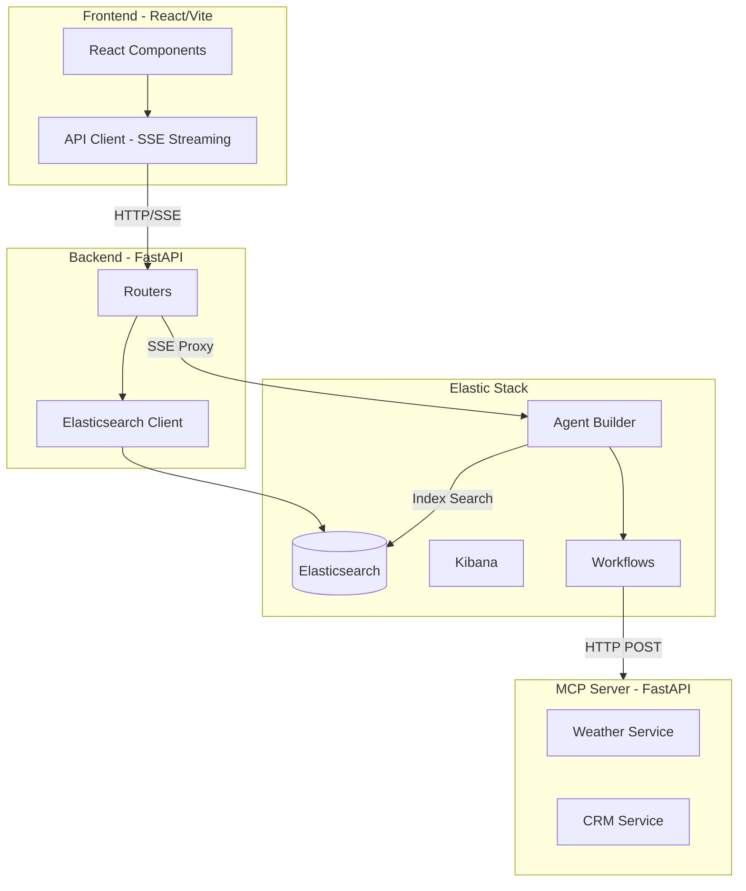

# AGENTS.md - AI Agent Onboarding Guide

> This document is designed for AI agents, coding assistants, and language models working on the Wayfinder Supply Co. codebase. It provides essential context, architecture details, and development patterns to help you contribute effectively.

## Project Overview

**Wayfinder Supply Co.** is a demonstration of **Elastic Agentic Search** capabilities — an AI-powered outdoor gear retailer with a Trip Planning assistant. It showcases how to build intelligent search experiences that go beyond keyword matching by:

- Federating data from Elasticsearch, simulated CRM, and Weather APIs
- Using clickstream data for real-time personalization
- Orchestrating multi-step AI workflows via Elastic Agent Builder
- Streaming agent responses with transparent reasoning (thought traces)

**Primary Use Cases:**
1. **Workshop/Training**: Instruqt-based hands-on labs teaching Elastic Agent Builder
2. **Demo Platform**: Standalone deployment for sales/marketing demonstrations
3. **Reference Architecture**: Example of agentic search patterns with Elasticsearch

---

## High-Level Architecture



### Component Responsibilities

| Component | Technology | Role |
|-----------|------------|------|
| **Frontend** | React 18, Vite, TypeScript, Tailwind | UI rendering, SSE streaming, state management |
| **Backend** | FastAPI, httpx | API proxy, Elasticsearch queries, SSE forwarding |
| **Agent Builder** | Kibana Plugin | AI agent orchestration, tool execution |
| **Workflows** | Elastic Workflows | Multi-step processes calling external systems |
| **MCP Server** | FastAPI, FastMCP | Simulates CRM and Weather APIs |
| **Elasticsearch** | ES 9.x with ELSER | Product catalog, clickstream, semantic search |

---

## Backend Architecture

### Entry Point: `backend/main.py`

- Loads environment variables (supports both Instruqt and standalone modes)
- Registers all routers under `/api/` prefix
- Configures CORS for workshop environments
- Serves static frontend files when present (unified serving mode)

### Router Organization: `backend/routers/`

| Router | Primary Endpoints | Purpose |
|--------|-------------------|---------|
| `chat.py` | `/api/chat`, `/api/parse-trip-context` | Agent Builder streaming, context extraction |
| `products.py` | `/api/products`, `/api/products/search` | Product CRUD, semantic/hybrid/lexical search |
| `cart.py` | `/api/cart` | Shopping cart management |
| `clickstream.py` | `/api/clickstream` | User behavior tracking |
| `workshop.py` | `/api/workshop/status` | Workshop progress tracking |
| `users.py` | `/api/users/personas` | User persona data |
| `reviews.py` | `/api/products/{id}/reviews` | Product reviews |
| `orders.py` | `/api/orders` | Order creation |

### Agent Builder Integration (`chat.py`)

The chat router proxies requests to Kibana's Agent Builder API and transforms SSE events:

```python
# Kibana Agent Builder endpoint
KIBANA_URL + "/api/agent_builder/converse/async"

# Required headers for Agent Builder
headers = {
    "Authorization": f"ApiKey {ELASTICSEARCH_APIKEY}",
    "Content-Type": "application/json",
    "kbn-xsrf": "true",
    "x-elastic-internal-origin": "kibana",  # Required for workflows
}
```

**SSE Event Types (Backend → Frontend):**

| Event | Purpose | Payload |
|-------|---------|---------|
| `reasoning` | Agent thinking steps | `{"content": "..."}` |
| `tool_call` | Tool invocation | `{"tool": "name", "params": {...}}` |
| `tool_result` | Tool execution result | `{"tool": "name", "result": {...}}` |
| `message_chunk` | Streaming text | `{"content": "..."}` |
| `message_complete` | Final message | `{"content": "..."}` |
| `error` | Error from agent | `{"error": "...", "code": "..."}` |

### Elasticsearch Client (`services/elastic_client.py`)

Singleton pattern for connection reuse:

```python
# Environment variable fallback chain
ES_URL = os.getenv("STANDALONE_ELASTICSEARCH_URL", 
         os.getenv("ELASTICSEARCH_URL", "http://kubernetes-vm:30920"))
```

---

## Frontend Architecture

### State Management

- **No global state library** — uses React hooks (`useState`, `useEffect`)
- **Lifted state in `App.tsx`** — persists across navigation for `SearchPanel` and `TripPlanner`
- **Component-level state** — messages, search results, UI state

### Key Components

| Component | Location | Purpose |
|-----------|----------|---------|
| `TripPlanner.tsx` | `frontend/src/components/` | Main trip planning interface with streaming chat |
| `SearchPanel.tsx` | `frontend/src/components/` | Slide-out search panel (Chat/Hybrid/Lexical modes) |
| `ProductCard.tsx` | `frontend/src/components/` | Reusable product display card |
| `StepRenderer.tsx` | `frontend/src/components/search/` | Renders agent reasoning steps |
| `ChatMode.tsx` | `frontend/src/components/search/` | Chat mode with product cards |

### Streaming Response Handling

The frontend uses `ReadableStream` to process SSE events from the backend:

```typescript
// frontend/src/lib/api.ts
const reader = response.body?.getReader();
const decoder = new TextDecoder();

while (true) {
  const { done, value } = await reader.read();
  if (done) break;
  
  const chunk = decoder.decode(value);
  // Parse SSE events: "event: type\ndata: {...}\n\n"
}
```

### Product Extraction from Agent Responses

Products are extracted from agent responses in two ways:

1. **From `tool_result` events** (primary):
   ```typescript
   // When product_search tool returns results
   if (toolName === 'product_search' && result?.hits) {
     const products = result.hits.map(hit => hit._source);
   }
   ```

2. **From response text** (fallback regex):
   ```typescript
   // Pattern: **Product Name** - $123.45
   const productPattern = /\*\*([^*]+)\*\*\s*[-–]\s*\$?([\d,.]+)/g;
   ```

---

## Elastic Stack Integration

### Agents

| Agent ID | Purpose | Tools |
|----------|---------|-------|
| `trip-planner-agent` | Main orchestrator for trip planning | All tools |
| `wayfinder-search-agent` | Product search assistant | `product_search`, `get_user_affinity` |
| `context-extractor-agent` | Extracts trip entities from text | None (parsing only) |
| `response-parser-agent` | Extracts structured JSON from responses | None (parsing only) |
| `itinerary-extractor-agent` | Extracts day-by-day itinerary | None (parsing only) |

### Tools

| Tool ID | Type | Purpose |
|---------|------|---------|
| `tool-search-product-search` | `index_search` | Semantic search on `product-catalog` |
| `tool-esql-get-user-affinity` | `esql` | Query clickstream for user preferences |
| `tool-workflow-check-trip-safety` | `workflow` | Get weather conditions |
| `tool-workflow-get-customer-profile` | `workflow` | Get CRM data |

### Workflows (`config/workflows/`)

| Workflow | Purpose | External Call |
|----------|---------|---------------|
| `check_trip_safety.yaml` | Weather and road conditions | MCP Server |
| `get_customer_profile.yaml` | Customer CRM data | MCP Server |
| `get_user_affinity.yaml` | User preference aggregation | ES|QL query |
| `extract_trip_entities.yaml` | Parse agent responses | Calls `response-parser-agent` |

### Elasticsearch Indices

| Index | Purpose | Key Fields |
|-------|---------|------------|
| `product-catalog` | Product data with ELSER | `title`, `description`, `description.semantic`, `tags`, `price` |
| `user-clickstream` | User behavior events | `user_id`, `action`, `product_id`, `meta_tags`, `@timestamp` |
| `product-reviews` | Product reviews | `product_id`, `rating`, `review_text` |

### Personalization Strategy

Personalization uses **query-time boosting** based on clickstream data:

1. Aggregate user's `meta_tags` from `user-clickstream`
2. Apply `function_score` boost to search queries
3. Products matching user preferences rank higher

```json
{
  "function_score": {
    "query": { "match": { "title": "camping gear" } },
    "functions": [
      {
        "filter": { "terms": { "tags": ["ultralight", "expedition"] } },
        "weight": 1.5
      }
    ]
  }
}
```

---

## Development Patterns

### Environment Variable Strategy

**Dual-cluster pattern for data isolation:**

| Prefix | Purpose | Used By |
|--------|---------|---------|
| `SNAPSHOT_*` | Source cluster for data loading | `setup_elastic.py`, `seed_*.py` |
| `STANDALONE_*` | Runtime demo cluster | Backend services, `create_agents.py` |

**Fallback chain:**
```python
ES_URL = os.getenv("STANDALONE_ELASTICSEARCH_URL", 
         os.getenv("ELASTICSEARCH_URL", "http://kubernetes-vm:30920"))
```

### UI Design System

- **Glass-morphism**: `backdrop-blur-md bg-white/10` for translucent panels
- **Dark theme**: Slate/zinc color palette
- **Animations**: Framer Motion for transitions
- **Icons**: Lucide React
- **Typography**: System fonts with Tailwind defaults

### Code Style

- **Backend**: Python with type hints, FastAPI patterns
- **Frontend**: TypeScript strict mode, functional components
- **API Design**: RESTful under `/api/` prefix
- **Streaming**: SSE for real-time updates

---

## Deployment Paths

### Path A: Standalone (Docker Compose)

```bash
# 1. Configure environment
cp .env.example .env
# Edit .env with STANDALONE_* credentials

# 2. Setup Elastic components
./scripts/standalone_setup.sh [--load-data]

# 3. Start services
docker-compose up -d

# Access at http://localhost:8000
```

**Services:**
- `backend`: FastAPI on port 8000
- `mcp-server`: MCP on port 8001
- `frontend`: React dev server on port 3000 (or served by backend)

### Path B: Instruqt Workshop

- **VMs**: `kubernetes-vm` (Elastic), `host-1` (App)
- **Setup**: Automated via `instruqt/track_scripts/`
- **Data**: Restored from GCS snapshot
- **Access**: Port 8000 on workshop host

---

## Key Files Reference

### Backend
| File | Purpose |
|------|---------|
| `backend/main.py` | FastAPI entry point, router registration |
| `backend/routers/chat.py` | Agent Builder streaming, context extraction |
| `backend/routers/products.py` | Product search (semantic, hybrid, lexical) |
| `backend/services/elastic_client.py` | Elasticsearch singleton client |

### Frontend
| File | Purpose |
|------|---------|
| `frontend/src/App.tsx` | Main app, routing, lifted state |
| `frontend/src/components/TripPlanner.tsx` | Trip planning UI with streaming |
| `frontend/src/components/SearchPanel.tsx` | Search modes (Chat/Hybrid/Lexical) |
| `frontend/src/lib/api.ts` | API client with SSE streaming |

### Scripts
| File | Purpose |
|------|---------|
| `scripts/standalone_setup.sh` | Main setup orchestrator |
| `scripts/create_agents.py` | Creates agents, tools, deploys workflows |
| `scripts/deploy_workflows.py` | Deploys workflow YAML files |
| `scripts/setup_elastic.py` | Creates Elasticsearch indices |
| `scripts/seed_products.py` | Loads product catalog |
| `scripts/seed_clickstream.py` | Generates user behavior data |

### Configuration
| File | Purpose |
|------|---------|
| `config/workflows/*.yaml` | Elastic Workflow definitions |
| `config/product_generation.yaml` | Product generation settings |
| `.env.example` | Environment variable template |
| `docker-compose.yml` | Local development services |

### Data
| File | Purpose |
|------|---------|
| `generated_products/products.json` | Product catalog (150+ items) |
| `generated_products/reviews.json` | Product reviews |
| `mcp_server/data/locations.json` | 30 adventure destinations |
| `mcp_server/data/crm_mock.json` | Mock customer profiles |

---

## Common Tasks

### Adding a New Workflow

1. Create YAML in `config/workflows/`
2. Add to `workflows` dict in `scripts/create_agents.py`
3. Run `python scripts/deploy_workflows.py`
4. Optionally create a workflow tool in `create_agents.py`

### Adding a New Agent

1. Define agent function in `scripts/create_agents.py`
2. Call it in the `main()` function
3. Run `python scripts/create_agents.py`

### Modifying Search Behavior

- **Semantic search**: `backend/routers/products.py` → `hybrid_search()`
- **Personalization**: `backend/routers/products.py` → `get_user_preferences()`
- **Agent search tool**: Configured in `scripts/create_agents.py`

### Debugging Agent Responses

1. Check backend logs: `docker-compose logs -f backend`
2. View thought traces in UI (expandable panel)
3. Test agents directly in Kibana Agent Builder UI
4. Check Kibana workflow execution logs

---

## API Quick Reference

### Chat Streaming
```bash
curl -X POST "http://localhost:8000/api/chat" \
  -H "Content-Type: application/json" \
  -d '{"message": "Plan a trip to Yosemite", "user_id": "user_new"}'
```

### Product Search
```bash
# Hybrid search
curl "http://localhost:8000/api/products/search/hybrid?q=camping+tent&user_id=user_new"

# Lexical search
curl "http://localhost:8000/api/products/search/lexical?q=camping+tent"
```

### Clickstream Tracking
```bash
curl -X POST "http://localhost:8000/api/clickstream" \
  -H "Content-Type: application/json" \
  -d '{"user_id": "user_new", "action": "view_item", "product_id": "prod_123"}'
```

---

## Additional Documentation

| Document | Purpose |
|----------|---------|
| `README.md` | User-facing setup and feature overview |
| `docs/ARCHITECTURE.md` | Detailed system architecture |
| `docs/AGENT_CHEATSHEET.md` | Agent Builder API patterns |
| `docs/TOOL_CHEATSHEET.md` | Tool creation reference |
| `docs/WORKFLOW_CHEATSHEET.md` | Workflow YAML syntax |
| `docs/API_REFERENCE.md` | Backend API documentation |
| `docs/WORKSHOP_GUIDE.md` | Instruqt workshop instructions |

---

## Important Constraints

1. **Never push to `main` without testing** — This is a live demo/workshop platform
2. **Preserve Instruqt compatibility** — Changes must work in both standalone and Instruqt modes
3. **Agent Builder API quirks** — Workflows use `/api/workflows/search` (POST) to list, not GET
4. **ELSER dependency** — Semantic search requires ELSER model deployed on the cluster
5. **MCP Server URLs** — Port 8001 locally, port 8002 in Instruqt

---

*Last updated: 2026-01-26*
