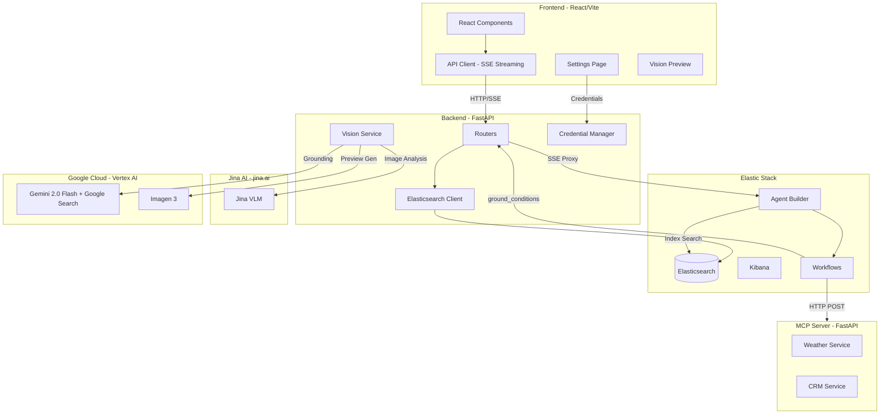

# AGENTS.md - AI Agent Onboarding Guide

> This document is designed for AI agents, coding assistants, and language models working on the Wayfinder Supply Co. codebase. It provides essential context, architecture details, and development patterns to help you contribute effectively.

## Branch Context

**Current branch: `feature/jina-vlm-vision`**

This branch extends the base Wayfinder Supply Co. demo with **Vision AI capabilities**:

- **Jina VLM** (jina.ai) — Terrain/scene analysis from user-uploaded photos
- **Google Gemini 2.0 Flash + Google Search** — Real-time weather/trail grounding
- **Imagen 3** (Vertex AI) — Product-in-scene visualization
- **Credential Manager** — Runtime credential management with UI settings, env vars, and ADC fallback
- **API Key Middleware** — Optional auth for all API endpoints
- **Cloud Run Deployment** — Production deployment with IAP, Artifact Registry, and service-to-service auth
- **Architecture Diagrams** — Auto-generated Excalidraw diagrams rendered via kroki.io

**Feature gating:** Vision features are progressively enabled based on configured credentials:
- **No keys**: Original app works normally; vision UI is hidden
- **Jina key only**: Image upload + terrain-aware trip recommendations
- **Jina + Vertex AI**: Plus real-time grounding and Imagen 3 product previews

---

## Project Overview

**Wayfinder Supply Co.** is a demonstration of **Elastic Agentic Search** capabilities — an AI-powered outdoor gear retailer with a Trip Planning assistant. It showcases how to build intelligent search experiences that go beyond keyword matching by:

- Federating data from Elasticsearch, simulated CRM, and Weather APIs
- Using clickstream data for real-time personalization
- Orchestrating multi-step AI workflows via Elastic Agent Builder
- Streaming agent responses with transparent reasoning (thought traces)
- **Vision AI**: Analyzing terrain photos, grounding with live weather, and generating product-in-scene previews

**Primary Use Cases:**
1. **Workshop/Training**: Instruqt-based hands-on labs teaching Elastic Agent Builder
2. **Demo Platform**: Standalone deployment for sales/marketing demonstrations
3. **Reference Architecture**: Example of agentic search patterns with Elasticsearch

---

## High-Level Architecture



### Component Responsibilities

| Component | Technology | Role |
|-----------|------------|------|
| **Frontend** | React 18, Vite, TypeScript, Tailwind | UI rendering, SSE streaming, state management |
| **Backend** | FastAPI, httpx | API proxy, Elasticsearch queries, SSE forwarding |
| **Vision Service** | Python, google-genai, httpx | Jina VLM, Gemini grounding, Imagen 3 preview generation |
| **Credential Manager** | Python singleton | Runtime credential management (UI → env → ADC) |
| **Agent Builder** | Kibana Plugin | AI agent orchestration, tool execution |
| **Workflows** | Elastic Workflows | Multi-step processes calling external systems |
| **MCP Server** | FastAPI, FastMCP | Simulates CRM and Weather APIs |
| **Elasticsearch** | ES 9.x with ELSER | Product catalog, clickstream, semantic search |
| **Jina VLM** | External API (jina.ai) | Terrain/scene image analysis |
| **Gemini + Google Search** | Vertex AI (GCP) | Real-time weather and trail condition grounding |
| **Imagen 3** | Vertex AI (GCP) | Product-in-scene image generation |

---

## Vision Pipeline

The vision pipeline is the primary new feature on this branch. It has three phases:

### Phase 1: Image Analysis (Jina VLM)

1. User attaches a terrain photo in Trip Planner (JPEG/PNG/WebP, resized to max 2048px client-side)
2. `POST /api/chat` with `image_base64` → backend calls `vision_service.analyze_image()`
3. Jina VLM API (`https://api-beta-vlm.jina.ai/v1/chat/completions`, model `jina-vlm`) analyzes terrain
4. Result injected into agent prompt as `[Vision Context: {description}] [User ID: {uid}] {message}`
5. A `vision_analysis` SSE event is emitted first, then the normal agent stream begins

### Phase 2: Weather Grounding (Gemini + Google Search)

1. Agent Builder invokes the `ground_conditions` workflow with `location` and `activity`
2. Workflow calls `POST /api/vision/ground` on the backend
3. Backend uses Vertex AI Gemini 2.0 Flash with `Tool(google_search=GoogleSearch())` for live search grounding
4. Returns structured JSON: `temperature_f`, `conditions`, `wind_mph`, `trail_status`, `safety_notes`

### Phase 3: Product Visualization (Imagen 3)

1. User clicks **Visualize** on a recommended product (requires Imagen configured + scene image)
2. `POST /api/vision/preview` with `image_base64`, `product_name`, `scene_description`
3. **Pass 1**: Text-to-image scene generation from Jina description
4. **Pass 2**: Composite with product (wearable detection adjusts prompt); uses `product_image_url` as `StyleReferenceImage` when available
5. **Fallback chain**: With style ref → without style ref → single-pass text-to-image
6. Returns base64 PNG shown in a modal with download option

### Key Vision Files

| File | Role |
|------|------|
| `backend/services/vision_service.py` | All vision logic: `analyze_image()`, `ground_conditions()`, `generate_preview()` |
| `backend/routers/vision.py` | Vision endpoints: `/api/vision/ground`, `/api/vision/preview`, `/api/vision/status` |
| `backend/routers/chat.py` | Integrates vision into chat flow: image handling, context injection |
| `frontend/src/components/TripPlanner.tsx` | Image upload UI, handles `vision_analysis` SSE events, insight cards |
| `frontend/src/components/VisionPreview.tsx` | Visualize button on products, Imagen preview modal, "Show Prompt" |

---

## Credential Management

The credential manager provides a **three-tier priority system**:

1. **UI Settings** (in-memory, runtime override — lost on restart)
2. **Environment variables** (`.env` file or Docker env)
3. **ADC** (Application Default Credentials, for GCP when `VERTEX_PROJECT_ID` is set)

### Vertex AI Credential Paths

- **Path A**: Paste full service account JSON in Settings UI → auto-extracts `project_id`
- **Path B**: `VERTEX_PROJECT_ID` + `GOOGLE_APPLICATION_CREDENTIALS` file path
- **Path C**: `VERTEX_PROJECT_ID` + ADC (`gcloud auth application-default login`)

### Files

| File | Role |
|------|------|
| `backend/services/credential_manager.py` | Singleton `CredentialManager`: `get()`, `set()`, `set_service_account_json()`, `get_vertex_credentials()`, `status()` |
| `backend/routers/settings.py` | `GET /api/settings/status`, `POST /api/settings`, `POST /api/settings/test/jina`, `POST /api/settings/test/vertex` |
| `frontend/src/components/SettingsPage.tsx` | UI for Jina key and GCP SA JSON, status badges, test buttons |

### Environment Variables (Vision Features)

| Variable | Purpose |
|----------|---------|
| `JINA_API_KEY` | Jina VLM API key (from jina.ai, ~10M free tokens) |
| `VERTEX_PROJECT_ID` | GCP project ID for Vertex AI APIs |
| `VERTEX_LOCATION` | Vertex AI region (default: `us-central1`) |
| `GOOGLE_APPLICATION_CREDENTIALS` | Path to GCP service account JSON file |
| `GCP_SERVICE_ACCOUNT_JSON` | Full JSON content (runtime, set via UI) |
| `WAYFINDER_API_KEY` | Optional API key for endpoint auth |

---

## Security and Authentication

### API Key Middleware (`backend/middleware/auth.py`)

- When `WAYFINDER_API_KEY` env var is set, requires `X-Api-Key` header on `/api/*` and `/mcp/*`
- Exempt paths: `/health`, `/`, `/docs`, `/openapi.json`
- When unset, auth is skipped (local dev mode)

### Workflow → Backend Auth

- `scripts/create_agents.py` and `scripts/deploy_workflows.py` inject `api_key` into workflow consts
- Workflows send `X-Api-Key` in HTTP headers when calling backend/MCP endpoints

### Frontend Auth

- `VITE_WAYFINDER_API_KEY` baked into frontend at build time
- Used by `frontend/src/lib/api.ts` in `authHeaders()`

### IAP (Cloud Run only)

- Optional Identity-Aware Proxy restricts access to `@elastic.co` Google accounts
- Configured via `gcloud beta run services update --iap`

---

## Backend Architecture

### Entry Point: `backend/main.py`

- Loads environment variables (supports both Instruqt and standalone modes)
- Registers all routers under `/api/` prefix
- Adds `ApiKeyMiddleware` when `WAYFINDER_API_KEY` is set
- Configures CORS for workshop environments
- Serves static frontend files when present (unified serving mode)

### Router Organization: `backend/routers/`

| Router | Primary Endpoints | Purpose |
|--------|-------------------|---------|
| `chat.py` | `/api/chat`, `/api/parse-trip-context` | Agent Builder streaming, vision context injection |
| `products.py` | `/api/products`, `/api/products/search` | Product CRUD, semantic/hybrid/lexical search |
| `vision.py` | `/api/vision/ground`, `/api/vision/preview`, `/api/vision/status` | Weather grounding, Imagen 3 previews |
| `settings.py` | `/api/settings`, `/api/settings/status`, `/api/settings/test/*` | Credential management UI |
| `cart.py` | `/api/cart` | Shopping cart management |
| `clickstream.py` | `/api/clickstream` | User behavior tracking |
| `workshop.py` | `/api/workshop/status` | Workshop progress tracking |
| `users.py` | `/api/users/personas` | User persona data |
| `reviews.py` | `/api/products/{id}/reviews` | Product reviews |
| `orders.py` | `/api/orders` | Order creation |

### Services: `backend/services/`

| Service | Purpose |
|---------|---------|
| `elastic_client.py` | Elasticsearch singleton client |
| `vision_service.py` | Jina VLM analysis, Gemini grounding, Imagen 3 generation |
| `credential_manager.py` | Three-tier credential resolution (UI → env → ADC) |

### Agent Builder Integration (`chat.py`)

The chat router proxies requests to Kibana's Agent Builder API and transforms SSE events:

```python
# Kibana Agent Builder endpoint
KIBANA_URL + "/api/agent_builder/converse/async"

# Required headers for Agent Builder
headers = {
    "Authorization": f"ApiKey {ELASTICSEARCH_APIKEY}",
    "Content-Type": "application/json",
    "kbn-xsrf": "true",
    "x-elastic-internal-origin": "kibana",  # Required for workflows
}
```

**Vision integration in chat flow:**
```python
# If image_base64 is present and Jina is configured:
# 1. Call vision_service.analyze_image(image_base64)
# 2. Emit SSE event: vision_analysis with description
# 3. Inject: "[Vision Context: {desc}] [User ID: {uid}] {message}"
# 4. Send enriched message to Agent Builder
```

**SSE Event Types (Backend → Frontend):**

| Event | Purpose | Payload |
|-------|---------|---------|
| `vision_analysis` | Jina VLM terrain description | `{"description": "..."}` |
| `reasoning` | Agent thinking steps | `{"content": "..."}` |
| `tool_call` | Tool invocation | `{"tool": "name", "params": {...}}` |
| `tool_result` | Tool execution result | `{"tool": "name", "result": {...}}` |
| `message_chunk` | Streaming text | `{"content": "..."}` |
| `message_complete` | Final message | `{"content": "..."}` |
| `error` | Error from agent | `{"error": "...", "code": "..."}` |

### Elasticsearch Client (`services/elastic_client.py`)

Singleton pattern for connection reuse:

```python
# Environment variable fallback chain
ES_URL = os.getenv("STANDALONE_ELASTICSEARCH_URL", 
         os.getenv("ELASTICSEARCH_URL", "http://kubernetes-vm:30920"))
```

---

## Frontend Architecture

### State Management

- **No global state library** — uses React hooks (`useState`, `useEffect`)
- **Lifted state in `App.tsx`** — persists across navigation for `SearchPanel` and `TripPlanner`
- **Settings status** — `settingsStatus` state in `App.tsx`, passed to components for feature gating
- **Component-level state** — messages, search results, UI state

### Key Components

| Component | Location | Purpose |
|-----------|----------|---------|
| `TripPlanner.tsx` | `frontend/src/components/` | Main trip planning interface with streaming chat + image upload |
| `SearchPanel.tsx` | `frontend/src/components/` | Slide-out search panel (Chat/Hybrid/Lexical modes) |
| `ProductCard.tsx` | `frontend/src/components/` | Reusable product display card |
| `VisionPreview.tsx` | `frontend/src/components/` | Imagen 3 product-in-scene preview with modal |
| `SettingsPage.tsx` | `frontend/src/components/` | Vision credential management (Jina key, GCP SA JSON) |
| `StepRenderer.tsx` | `frontend/src/components/search/` | Renders agent reasoning steps |
| `ChatMode.tsx` | `frontend/src/components/search/` | Chat mode with product cards |

### Frontend Types (`frontend/src/types/index.ts`)

Key types added for vision features:

| Type | Fields |
|------|--------|
| `VisionServiceStatus` | `'configured_ui' \| 'configured_env' \| 'not_configured'` |
| `SettingsStatus` | `{ jina_vlm, vertex_ai, imagen, vertex_project_id? }` |
| `ChatMessage` | Added `image_url?`, `generated_preview?` |

### Streaming Response Handling

The frontend uses `ReadableStream` to process SSE events from the backend:

```typescript
// frontend/src/lib/api.ts
const reader = response.body?.getReader();
const decoder = new TextDecoder();

while (true) {
  const { done, value } = await reader.read();
  if (done) break;
  
  const chunk = decoder.decode(value);
  // Parse SSE events: "event: type\ndata: {...}\n\n"
}
```

### Product Extraction from Agent Responses

Products are extracted from agent responses in two ways:

1. **From `tool_result` events** (primary):
   ```typescript
   // When product_search tool returns results
   if (toolName === 'product_search' && result?.hits) {
     const products = result.hits.map(hit => hit._source);
   }
   ```

2. **From response text** (fallback regex):
   ```typescript
   // Pattern: **Product Name** - $123.45
   const productPattern = /\*\*([^*]+)\*\*\s*[-–]\s*\$?([\d,.]+)/g;
   ```

---

## Elastic Stack Integration

### Agents

| Agent ID | Purpose | Tools |
|----------|---------|-------|
| `trip-planner-agent` | Main orchestrator for trip planning (vision-aware) | All tools |
| `wayfinder-search-agent` | Product search assistant | `product_search`, `get_user_affinity` |
| `context-extractor-agent` | Extracts trip entities from text | None (parsing only) |
| `response-parser-agent` | Extracts structured JSON from responses | None (parsing only) |
| `itinerary-extractor-agent` | Extracts day-by-day itinerary | None (parsing only) |

The trip planner agent instructions reference `[Vision Context: ...]` and will use `ground_conditions` for live weather when available.

### Tools

| Tool ID | Type | Purpose |
|---------|------|---------|
| `tool-search-product-search` | `index_search` | Semantic search on `product-catalog` |
| `tool-esql-get-user-affinity` | `esql` | Query clickstream for user preferences |
| `tool-workflow-check-trip-safety` | `workflow` | Get weather conditions (MCP mock) |
| `tool-workflow-get-customer-profile` | `workflow` | Get CRM data |
| `tool-workflow-ground-conditions` | `workflow` | Real-time weather/trail via Gemini + Google Search |

### Workflows (`config/workflows/`)

| Workflow | Purpose | External Call |
|----------|---------|---------------|
| `check_trip_safety.yaml` | Weather and road conditions | MCP Server |
| `get_customer_profile.yaml` | Customer CRM data | MCP Server |
| `get_user_affinity.yaml` | User preference aggregation | ES\|QL query |
| `extract_trip_entities.yaml` | Parse agent responses | Calls `response-parser-agent` |
| `ground_conditions.yaml` | **Live weather grounding** | Backend `/api/vision/ground` → Gemini + Google Search |

### Elasticsearch Indices

| Index | Purpose | Key Fields |
|-------|---------|------------|
| `product-catalog` | Product data with ELSER | `title`, `description`, `description.semantic`, `tags`, `price` |
| `user-clickstream` | User behavior events | `user_id`, `action`, `product_id`, `meta_tags`, `@timestamp` |
| `product-reviews` | Product reviews | `product_id`, `rating`, `review_text` |

### Personalization Strategy

Personalization uses **query-time boosting** based on clickstream data:

1. Aggregate user's `meta_tags` from `user-clickstream`
2. Apply `function_score` boost to search queries
3. Products matching user preferences rank higher

```json
{
  "function_score": {
    "query": { "match": { "title": "camping gear" } },
    "functions": [
      {
        "filter": { "terms": { "tags": ["ultralight", "expedition"] } },
        "weight": 1.5
      }
    ]
  }
}
```

---

## External Service Integration

### Jina AI (jina.ai) — NOT in GCP

| Detail | Value |
|--------|-------|
| **API URL** | `https://api-beta-vlm.jina.ai/v1/chat/completions` |
| **Model** | `jina-vlm` |
| **Auth** | `Bearer {JINA_API_KEY}` |
| **Free tier** | ~10M tokens |
| **Purpose** | Terrain/scene photo analysis for trip context |

### Google Cloud (Vertex AI)

| Service | Model | Purpose |
|---------|-------|---------|
| **Gemini** | `gemini-2.0-flash` | Weather/trail grounding with Google Search |
| **Imagen 3** | `imagen-3.0-generate-002` / `imagen-3.0-capability-001` | Product-in-scene image generation |
| **Auth** | Service account JSON or ADC | Via `google-genai` Python SDK |

---

## Development Patterns

### Environment Variable Strategy

**Dual-cluster pattern for data isolation:**

| Prefix | Purpose | Used By |
|--------|---------|---------|
| `SNAPSHOT_*` | Source cluster for data loading | `setup_elastic.py`, `seed_*.py` |
| `STANDALONE_*` | Runtime demo cluster | Backend services, `create_agents.py` |

**Fallback chain:**
```python
ES_URL = os.getenv("STANDALONE_ELASTICSEARCH_URL", 
         os.getenv("ELASTICSEARCH_URL", "http://kubernetes-vm:30920"))
```

### UI Design System

- **Glass-morphism**: `backdrop-blur-md bg-white/10` for translucent panels
- **Dark theme**: Slate/zinc color palette
- **Animations**: Framer Motion for transitions
- **Icons**: Lucide React
- **Typography**: System fonts with Tailwind defaults

### Code Style

- **Backend**: Python with type hints, FastAPI patterns
- **Frontend**: TypeScript strict mode, functional components
- **API Design**: RESTful under `/api/` prefix
- **Streaming**: SSE for real-time updates

### Architecture Diagram Color Coding

The project uses auto-generated Excalidraw diagrams (`scripts/render_diagrams.py`):

| Zone | Color | Components |
|------|-------|------------|
| Frontend | Blue (`#4a9eed`) | React/Vite, Trip Planner, Search Panel, Settings, Vision Preview |
| Backend | Purple (`#8b5cf6`) | FastAPI routers (Chat, Vision, Products), Credential Manager, API Key Auth |
| Elastic Stack | Green (`#22c55e`) | Elasticsearch 9.x, Kibana, Agent Builder, Workflows, ELSER |
| Google Cloud | Orange (`#f59e0b`) | Gemini + Grounding, Imagen 3 |
| Jina AI | Yellow (`#facc15`) | Jina VLM (external, jina.ai — NOT in GCP) |
| MCP Server | Teal (`#06b6d4`) | CRM / Persona, Weather (Mock) |

---

## Deployment Paths

### Path A: Standalone (Docker Compose)

```bash
# 1. Configure environment
cp .env.example .env
# Edit .env with STANDALONE_* credentials
# Optionally add JINA_API_KEY, VERTEX_PROJECT_ID, etc.

# 2. Setup Elastic components
./scripts/standalone_setup.sh [--load-data]

# 3. Start services
docker-compose up -d

# Access at http://localhost:8000
```

**Services:**
- `backend`: FastAPI on port 8000
- `mcp-server`: MCP on port 8001
- `frontend`: React dev server on port 3000 (or served by backend)

### Path B: Instruqt Workshop

- **VMs**: `kubernetes-vm` (Elastic), `host-1` (App)
- **Setup**: Automated via `instruqt/track_scripts/`
- **Data**: Restored from GCS snapshot
- **Access**: Port 8000 on workshop host

### Path C: Cloud Run (Production)

```bash
# Deploy all services to Cloud Run
./scripts/deploy_cloudrun.sh

# Services deployed:
# - MCP Server → mcp-server.run.app
# - Backend → wayfinder-backend.run.app
# - Frontend → wayfinder-frontend.run.app (with nginx)
```

**Cloud Run specifics:**
- `scripts/deploy_cloudrun.sh` builds & pushes images, deploys with env vars
- `WAYFINDER_API_KEY` protects backend/MCP endpoints
- `JINA_API_KEY`, `VERTEX_PROJECT_ID`, `GCP_SERVICE_ACCOUNT_JSON` passed as env vars
- `scripts/create_agents.py` and `scripts/deploy_workflows.py` accept `--wayfinder-api-key` flag
- Optional IAP restricts frontend to `@elastic.co` via `gcloud beta run services update --iap`
- Frontend served via nginx (`frontend/nginx.cloudrun.conf`)

### Local Development with Elastic Cloud

```bash
# Use ngrok to expose local backend for Elastic Cloud workflows
./scripts/start_local.sh
# Config: config/ngrok.yml
```

---

## Key Files Reference

### Backend
| File | Purpose |
|------|---------|
| `backend/main.py` | FastAPI entry point, router registration, middleware |
| `backend/routers/chat.py` | Agent Builder streaming, vision context injection |
| `backend/routers/products.py` | Product search (semantic, hybrid, lexical) |
| `backend/routers/vision.py` | Vision endpoints: grounding, preview, status |
| `backend/routers/settings.py` | Credential management API |
| `backend/services/elastic_client.py` | Elasticsearch singleton client |
| `backend/services/vision_service.py` | Jina VLM, Gemini grounding, Imagen 3 |
| `backend/services/credential_manager.py` | Three-tier credential resolution |
| `backend/middleware/auth.py` | API key middleware |

### Frontend
| File | Purpose |
|------|---------|
| `frontend/src/App.tsx` | Main app, routing, lifted state, settings status |
| `frontend/src/components/TripPlanner.tsx` | Trip planning UI with streaming + image upload |
| `frontend/src/components/SearchPanel.tsx` | Search modes (Chat/Hybrid/Lexical) |
| `frontend/src/components/VisionPreview.tsx` | Imagen 3 product preview modal |
| `frontend/src/components/SettingsPage.tsx` | Vision credential management UI |
| `frontend/src/lib/api.ts` | API client with SSE streaming + auth headers |
| `frontend/src/types/index.ts` | TypeScript types including vision types |

### Scripts
| File | Purpose |
|------|---------|
| `scripts/standalone_setup.sh` | Main setup orchestrator |
| `scripts/create_agents.py` | Creates agents, tools, deploys workflows |
| `scripts/deploy_workflows.py` | Deploys workflow YAML files |
| `scripts/deploy_cloudrun.sh` | Cloud Run deployment script |
| `scripts/start_local.sh` | Local dev with ngrok for Elastic Cloud |
| `scripts/setup_elastic.py` | Creates Elasticsearch indices |
| `scripts/seed_products.py` | Loads product catalog |
| `scripts/seed_clickstream.py` | Generates user behavior data |
| `scripts/render_diagrams.py` | Generates Excalidraw architecture diagrams |

### Configuration
| File | Purpose |
|------|---------|
| `config/workflows/*.yaml` | Elastic Workflow definitions (includes `ground_conditions.yaml`) |
| `config/ngrok.yml` | ngrok tunnel config for local dev with Elastic Cloud |
| `config/product_generation.yaml` | Product generation settings |
| `.env.example` | Environment variable template |
| `docker-compose.yml` | Local development services |
| `frontend/nginx.cloudrun.conf` | nginx config for Cloud Run frontend |

### Data
| File | Purpose |
|------|---------|
| `generated_products/products.json` | Product catalog (150+ items) |
| `generated_products/reviews.json` | Product reviews |
| `mcp_server/data/locations.json` | 30 adventure destinations |
| `mcp_server/data/crm_mock.json` | Mock customer profiles |

### Documentation & Diagrams
| File | Purpose |
|------|---------|
| `docs/images/arch_high_level.png` | High-level architecture (5 zones + Jina) |
| `docs/images/arch_integration.png` | Elastic + Jina + Google integration flow |
| `docs/images/arch_vision_pipeline.png` | Vision pipeline detail (3 phases) |
| `docs/images/arch_security.png` | Security and authentication flow |
| `docs/images/arch_cloud_run.png` | Cloud Run deployment architecture |

---

## Common Tasks

### Adding a New Workflow

1. Create YAML in `config/workflows/`
2. Add to `workflows` dict in `scripts/create_agents.py`
3. Run `python scripts/deploy_workflows.py`
4. Optionally create a workflow tool in `create_agents.py`

### Adding a New Agent

1. Define agent function in `scripts/create_agents.py`
2. Call it in the `main()` function
3. Run `python scripts/create_agents.py`

### Modifying Search Behavior

- **Semantic search**: `backend/routers/products.py` → `hybrid_search()`
- **Personalization**: `backend/routers/products.py` → `get_user_preferences()`
- **Agent search tool**: Configured in `scripts/create_agents.py`

### Modifying Vision Behavior

- **Jina VLM prompt**: `backend/services/vision_service.py` → `analyze_image()`
- **Grounding prompt**: `backend/services/vision_service.py` → `ground_conditions()`
- **Imagen generation**: `backend/services/vision_service.py` → `generate_preview()`
- **Context injection format**: `backend/routers/chat.py` → look for `[Vision Context:`
- **Grounding workflow**: `config/workflows/ground_conditions.yaml`

### Updating Architecture Diagrams

1. Edit diagram builder functions in `scripts/render_diagrams.py`
2. Run `python scripts/render_diagrams.py` (requires `cairosvg` in `.venv` and network access to kroki.io)
3. Outputs `.excalidraw`, `.svg`, and `.png` to `docs/images/`
4. **Note**: The `svg_to_png()` function strips `<mask>` elements before conversion (cairosvg rendering bug workaround)
5. Color zones: Blue=Frontend, Purple=Backend, Green=Elastic, Orange=Google Cloud, Yellow=Jina AI, Teal=MCP

### Adding New Credentials / Services

1. Add key to `credential_manager.py` (`get()`/`set()` pattern)
2. Add status check in `credential_manager.py` → `status()`
3. Add UI field in `frontend/src/components/SettingsPage.tsx`
4. Add test endpoint in `backend/routers/settings.py` if applicable
5. Update `.env.example` with the new variable

### Debugging Agent Responses

1. Check backend logs: `docker-compose logs -f backend`
2. View thought traces in UI (expandable panel)
3. Test agents directly in Kibana Agent Builder UI
4. Check Kibana workflow execution logs

---

## API Quick Reference

### Chat Streaming (with optional image)
```bash
# Text only
curl -X POST "http://localhost:8000/api/chat" \
  -H "Content-Type: application/json" \
  -d '{"message": "Plan a trip to Yosemite", "user_id": "user_new"}'

# With image (Jina VLM analysis)
curl -X POST "http://localhost:8000/api/chat" \
  -H "Content-Type: application/json" \
  -d '{"message": "What gear do I need?", "user_id": "user_new", "image_base64": "data:image/jpeg;base64,..."}'
```

### Vision Endpoints
```bash
# Weather grounding
curl -X POST "http://localhost:8000/api/vision/ground" \
  -H "Content-Type: application/json" \
  -d '{"location": "Yosemite Valley", "activity": "hiking"}'

# Imagen preview
curl -X POST "http://localhost:8000/api/vision/preview" \
  -H "Content-Type: application/json" \
  -d '{"image_base64": "...", "product_name": "Trail Runner Pro", "scene_description": "Rocky alpine trail"}'

# Vision status
curl "http://localhost:8000/api/vision/status"
```

### Settings / Credentials
```bash
# Check status
curl "http://localhost:8000/api/settings/status"

# Set credentials
curl -X POST "http://localhost:8000/api/settings" \
  -H "Content-Type: application/json" \
  -d '{"jina_api_key": "jina_...", "gcp_service_account_json": "{...}"}'

# Test Jina connection
curl -X POST "http://localhost:8000/api/settings/test/jina"
```

### Product Search
```bash
# Hybrid search
curl "http://localhost:8000/api/products/search/hybrid?q=camping+tent&user_id=user_new"

# Lexical search
curl "http://localhost:8000/api/products/search/lexical?q=camping+tent"
```

### Clickstream Tracking
```bash
curl -X POST "http://localhost:8000/api/clickstream" \
  -H "Content-Type: application/json" \
  -d '{"user_id": "user_new", "action": "view_item", "product_id": "prod_123"}'
```

---

## Additional Documentation

| Document | Purpose |
|----------|---------|
| `README.md` | User-facing setup and feature overview |
| `docs/ARCHITECTURE.md` | Detailed system architecture |
| `docs/AGENT_CHEATSHEET.md` | Agent Builder API patterns |
| `docs/TOOL_CHEATSHEET.md` | Tool creation reference |
| `docs/WORKFLOW_CHEATSHEET.md` | Workflow YAML syntax |
| `docs/API_REFERENCE.md` | Backend API documentation |
| `docs/WORKSHOP_GUIDE.md` | Instruqt workshop instructions |
| `demo_scripts/` | Field and YouTube demo scripts |

---

## Important Constraints

1. **Never push to `main` without testing** — This is a live demo/workshop platform
2. **Preserve Instruqt compatibility** — Changes must work in both standalone and Instruqt modes
3. **Agent Builder API quirks** — Workflows use `/api/workflows/search` (POST) to list, not GET
4. **ELSER dependency** — Semantic search requires ELSER model deployed on the cluster
5. **MCP Server URLs** — Port 8001 locally, port 8002 in Instruqt
6. **Jina AI is NOT in GCP** — It's an external service at jina.ai; always color-code yellow, not orange
7. **Vision features are progressively gated** — No keys = no vision UI; Jina only = image analysis; Jina + Vertex = full pipeline
8. **Credential Manager is in-memory** — UI-set credentials are lost on restart; env vars are persistent

---

*Last updated: 2026-02-12*
