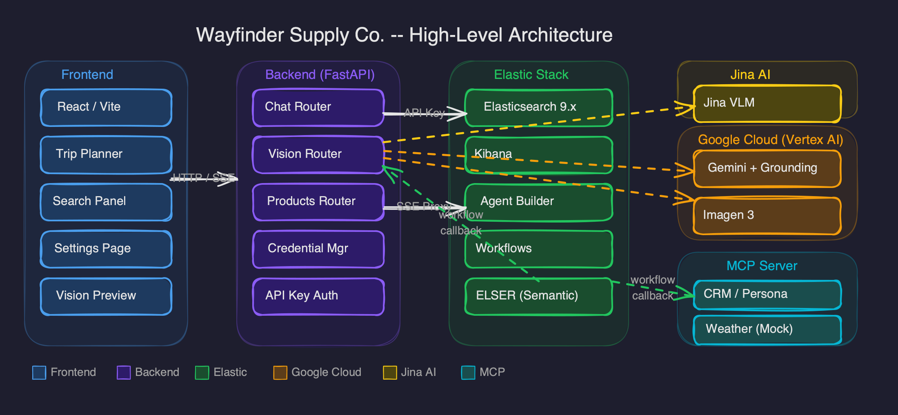
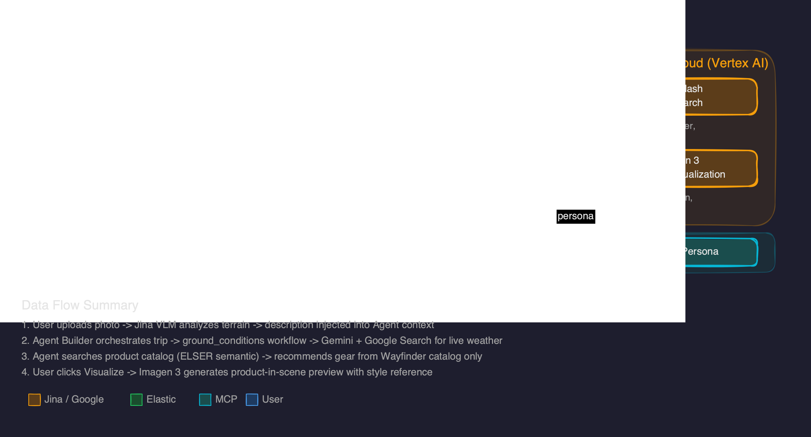
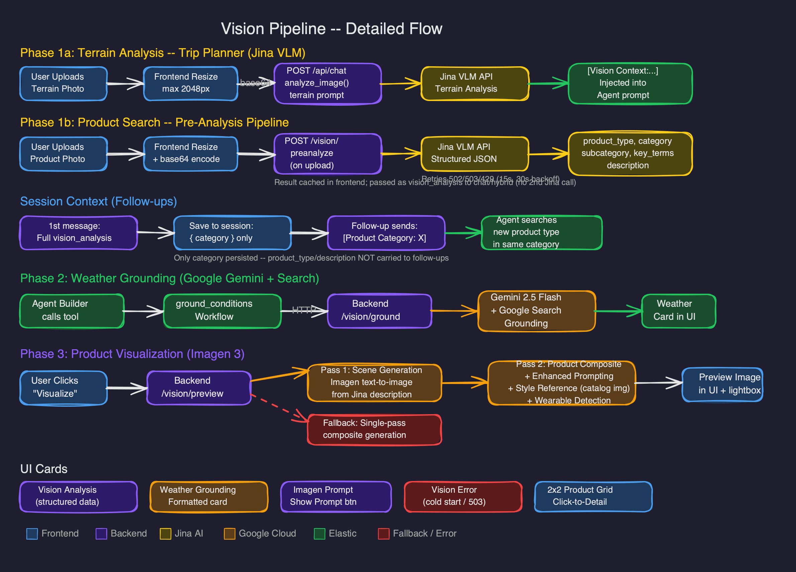
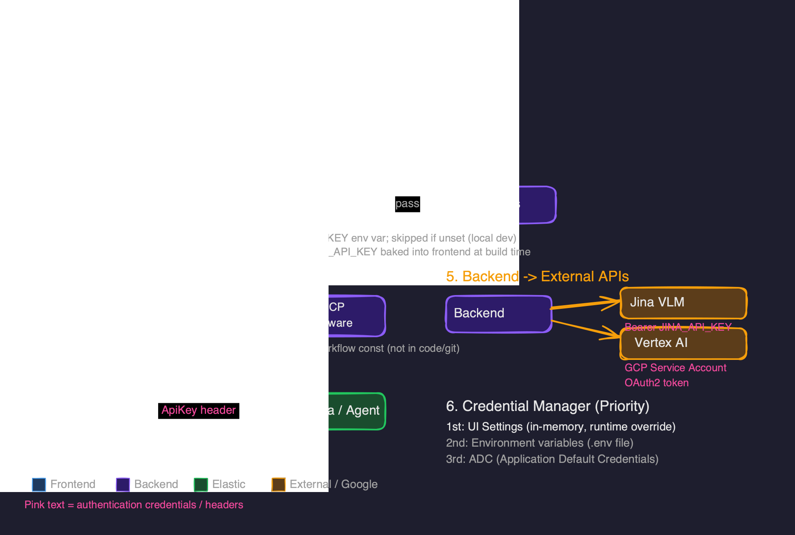
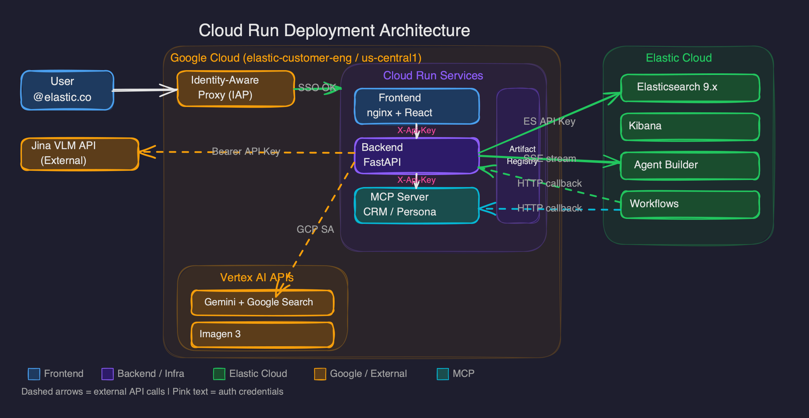
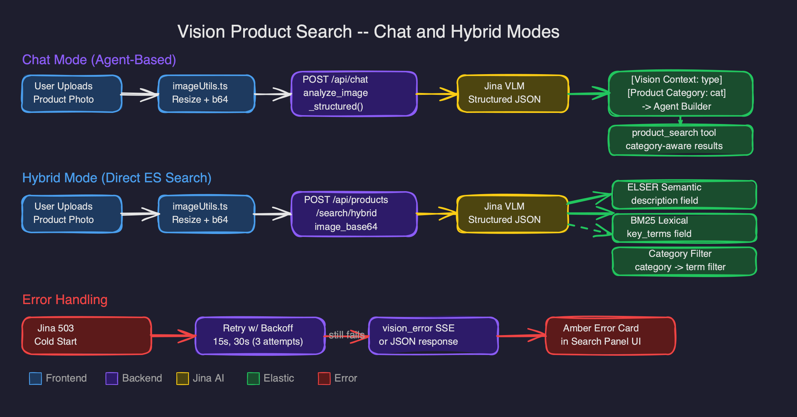

# Wayfinder Supply Co.

> **Status**: 🎉 **Stable v1.1** — Production-ready demo and workshop platform with vision AI features

An **Elastic + Google Better Together** demo showcasing **Elastic Agentic Search** through "Wayfinder Supply Co." — a fictional outdoor retailer with an AI-powered trip planning assistant, image analysis, real-time weather grounding, and AI-generated product visualizations.


## Current Release (v1.1 — Vision & Cloud Run)

**What's Working:**
- ✅ Complete E-commerce UI with 150+ products across 10 categories
- ✅ AI Trip Planner with streaming responses and persistent thought traces
- ✅ Personalization engine with real-time clickstream tracking
- ✅ Search modes: Lexical, Hybrid (ELSER), and Agentic
- ✅ Unified frontend/backend serving on port 8000
- ✅ Complete checkout flow with AI-generated reviews
- ✅ 5 pre-built user personas with rich clickstream data
- ✅ Interactive Guest User mode for live demos
- ✅ 30 global adventure destinations with seasonal data
- ✅ MCP server with CRM simulations (customer profiles)
- ✅ Instruqt workshop with 5 challenges
- ✅ Standalone Docker deployment mode
- ✅ **NEW** — Jina VLM image analysis (upload a photo, get terrain description)
- ✅ **NEW** — Image upload in Search and Chat flyout (Chat + Hybrid modes) for vision-based product search
- ✅ **NEW** — Structured Jina VLM analysis with category filtering for precise product matching
- ✅ **NEW** — Jina VLM cold-start retry with progressive backoff (502/503/429)
- ✅ **NEW** — Vision error handling with user-facing amber error cards
- ✅ **NEW** — Google Grounding for real-time weather via Gemini + Google Search
- ✅ **NEW** — Imagen 3 product visualization (generate product-in-scene images)
- ✅ **NEW** — UI Settings page for runtime credential configuration
- ✅ **NEW** — Google Cloud Run deployment with IAP authentication
- ✅ **NEW** — Insight cards showing Jina VLM and Weather grounding data

## Overview

This demo showcases how to build an intelligent, conversational shopping experience that goes beyond keyword matching:

- **Federated Data**: Combines Elasticsearch product catalog with simulated CRM APIs and Google Search grounding
- **Personalized Recommendations**: Uses clickstream data to understand user preferences (ultralight, budget, expedition, etc.)
- **AI Trip Planning**: Agent Builder orchestrates multi-step trip planning with gear recommendations
- **Image Analysis**: Upload a trip photo and Jina VLM analyzes terrain, season, and conditions
- **Real-time Weather**: Google Grounding (Gemini + Google Search) provides live weather for any destination
- **Product Visualization**: Imagen 3 generates photorealistic product-in-scene images from trip context
- **Location Intelligence**: Covers 30 global adventure destinations with seasonal activity data
- **Cloud Deployment**: One-script deployment to Google Cloud Run with IAP authentication

## Getting Started

### Path A: Standalone Local Run (Outside Instruqt)

Complete guide to run the demo from scratch using Docker and your own Elasticsearch cluster.

#### Prerequisites

Before starting, ensure you have:
- **Docker & Docker Compose** installed
- **Python 3.11+** installed
- **An Elasticsearch 9.x cluster** with Agent Builder enabled (Elastic Cloud recommended)
- **An API key** with permissions to create indices, agents, tools, and workflows

#### Step 1: Clone and Configure Environment

```bash
# Clone repo
git clone https://github.com/jeffvestal/wayfinder_supply_co.git
cd wayfinder_supply_co

# Create .env file from template
cp .env.example .env
```

Edit `.env` and set your Elasticsearch cluster credentials:

```bash
# Required for standalone demo
STANDALONE_ELASTICSEARCH_URL=https://your-cluster.es.us-west-2.aws.elastic.cloud:443
STANDALONE_ELASTICSEARCH_APIKEY=your-base64-encoded-api-key
STANDALONE_KIBANA_URL=https://your-cluster.kb.us-west-2.aws.elastic.cloud:443

# Required for data loading (can be same as STANDALONE_* or a different cluster)
SNAPSHOT_ELASTICSEARCH_URL=https://your-cluster.es.us-west-2.aws.elastic.cloud:443
SNAPSHOT_ELASTICSEARCH_APIKEY=your-base64-encoded-api-key
```

> **Note:** `STANDALONE_*` variables are used by the runtime services (backend, agents, workflows). `SNAPSHOT_*` variables are used by data loading scripts. They can point to the same cluster.

#### Step 2: Install Python Dependencies

```bash
pip install -r requirements.txt
```

#### Step 3: Load Data & Configure Elastic Stack

The setup script creates indices, loads products/reviews/clickstream, deploys workflows, and creates agents:

```bash
# For a new/empty cluster (most common)
./scripts/standalone_setup.sh --load-data
```

**What this does:**
1. Creates Elasticsearch indices (`product-catalog`, `product-reviews`, `user-clickstream`)
2. Loads product catalog (~150 products)
3. Loads product reviews
4. Loads clickstream data (user behavior for personalization)
5. Deploys workflows to Kibana (with MCP URLs configured for Docker)
6. Creates agents and tools in Agent Builder

**Alternative options:**

```bash
# If you already have data (e.g., restored from snapshot)
./scripts/standalone_setup.sh

# Load data only (skip agent/workflow setup)
./scripts/standalone_setup.sh --load-data --data-only

# Use custom MCP server URL (if not using Docker Compose)
./scripts/standalone_setup.sh --load-data --mcp-url http://localhost:8001/mcp
```

#### Step 4: Start Docker Services

```bash
# Build and start all containers (backend, frontend, MCP server)
docker-compose up -d

# View logs (optional)
docker-compose logs -f
```

**Services started:**
| Service | Port | Description |
|---------|------|-------------|
| `wayfinder-backend` | 8000 | FastAPI backend + serves frontend |
| `wayfinder-frontend` | 3000 | React dev server (optional, for development) |
| `wayfinder-mcp-server` | 8001 | Simulated Weather/CRM APIs |

#### Step 5: Verify & Access

```bash
# Check all components are working
python scripts/validate_setup.py --mode standalone

# Access the UI
open http://localhost:8000
```

**Expected output from validate_setup.py:**
```
✓ Elasticsearch connection OK
✓ product-catalog index exists (150 docs)
✓ product-reviews index exists
✓ user-clickstream index exists
✓ Agents configured
✓ Workflows deployed
✓ MCP server reachable
```

#### Troubleshooting

| Issue | Solution |
|-------|----------|
| "Connection refused" to Elasticsearch | Verify `STANDALONE_ELASTICSEARCH_URL` is correct and accessible |
| "401 Unauthorized" | Check `STANDALONE_ELASTICSEARCH_APIKEY` is valid |
| Workflows fail with "connection refused" | Ensure MCP server is running: `docker-compose ps` |
| Only 2 tools created (missing workflow tools) | Workflows may have failed - check script output for errors |
| Product reviews empty | Ensure `generated_products/reviews.json` exists |
| First search is slow | ELSER model warming up - subsequent searches will be faster |

#### Quick Reference: Environment Variables

| Variable | Required | Description |
|----------|----------|-------------|
| `STANDALONE_ELASTICSEARCH_URL` | Yes | Elasticsearch endpoint for runtime |
| `STANDALONE_ELASTICSEARCH_APIKEY` | Yes | API key for runtime services |
| `STANDALONE_KIBANA_URL` | Yes | Kibana endpoint (for Agent Builder APIs) |
| `SNAPSHOT_ELASTICSEARCH_URL` | Yes* | Elasticsearch for data loading (*same as STANDALONE if loading to runtime cluster) |
| `SNAPSHOT_ELASTICSEARCH_APIKEY` | Yes* | API key for data loading |

---

### Path B: Instruqt Workshop Environment

The preferred way to experience the full workshop with guided challenges.

- **Environment**: Two pre-configured VMs (`kubernetes-vm` for Elastic, `host-1` for App).
- **Setup**: All configurations are handled automatically by `instruqt/track_scripts/`.
- **Guide**: Follow the [Workshop Guide](docs/WORKSHOP_GUIDE.md) for step-by-step instructions.
- **Access**: UI is available on port 8000 of the workshop host.

---

### Path C: Google Cloud Run Deployment

Deploy the full stack to Google Cloud Run for a shareable, publicly accessible demo with Google IAP authentication.

#### Prerequisites

- **Google Cloud SDK** (`gcloud`) installed and authenticated
- **Docker** installed (for building images)
- A **GCP project** with billing enabled (e.g., `elastic-customer-eng`)
- An **Elasticsearch 9.x cluster** on Elastic Cloud
- (Optional) **Jina API key** for image analysis
- (Optional) **GCP Service Account** with Vertex AI User role for Imagen 3 + Google Grounding

#### Quick Deploy

```bash
# Set your .env with Elasticsearch credentials + optional vision keys
cp .env.example .env
# Edit .env (see Environment Variables section below)

# Deploy everything to Cloud Run (builds, pushes, deploys, configures IAP)
./scripts/deploy_cloudrun.sh --wayfinder-api-key "your-secret-key"
```

The script will:
1. Build Docker images for frontend, backend, and MCP server
2. Push them to Google Artifact Registry
3. Deploy all three as Cloud Run services
4. Configure Google IAP for frontend access (`@elastic.co` SSO)
5. Print the frontend URL when complete

#### Configuration Flags

| Flag | Description |
|------|-------------|
| `--wayfinder-api-key KEY` | Shared API key for workflow-to-backend authentication |
| `--project PROJECT` | GCP project ID (default: `elastic-customer-eng`) |
| `--region REGION` | GCP region (default: `us-central1`) |
| `--disable-iap` | Skip IAP setup (leave frontend publicly accessible) |

> **Note:** Vision features (Jina VLM, Imagen 3, Google Grounding) are **optional** and auto-enable when credentials are provided. The demo works without them — you just won't see image analysis, weather grounding, or product visualization features.

See [docs/DEPLOYMENT.md](docs/DEPLOYMENT.md) for full Cloud Run deployment details.

---

## Architecture

### High-Level Architecture

All major components and their connections — color-coded by responsibility.



| Zone | Color | Components |
|------|-------|------------|
| Frontend | Blue | React/Vite, Trip Planner, Search Panel, Settings, Vision Preview |
| Backend | Purple | FastAPI routers (Chat, Vision, Products), Credential Manager, API Key Auth |
| Elastic Stack | Green | Elasticsearch 9.x, Kibana, Agent Builder, Workflows, ELSER |
| Google / External | Orange | Jina VLM, Gemini + Grounding, Imagen 3 |
| MCP Server | Teal | CRM / Persona, Weather (Mock) |

### Elastic + Jina + Google Integration

How the three key platforms work together to power intelligent trip planning.



**Data flow:**
1. User uploads photo → **Jina VLM** analyzes terrain/conditions → description injected into Agent context
2. **Elastic Agent Builder** orchestrates trip plan → calls `ground_conditions` workflow → **Gemini + Google Search** for live weather
3. Agent searches product catalog (**ELSER** semantic search) → recommends gear from Wayfinder catalog only
4. User clicks Visualize → **Imagen 3** generates product-in-scene preview with style reference from catalog image

### Vision Pipeline (Detailed)

Step-by-step flow: image analysis, weather grounding, and product visualization.



**Phase 1 — Image Analysis (Jina VLM):** User selects photo → Frontend resizes (max 2048px) → Backend routes to Jina VLM API:
- **Trip Planner:** `POST /api/chat` with `image_base64` → `analyze_image()` (terrain prompt) → `[Vision Context: ...]` injected into Agent prompt
- **Search Panel (Chat/Hybrid):** `POST /api/chat` with `image_base64` → `analyze_image_structured()` (structured JSON)
- **Hybrid search only:** `POST /api/products/search/hybrid` with `image_base64` → `analyze_image_structured()`

**Phase 2 — Weather Grounding (Google):** Agent Builder calls tool → `ground_conditions` workflow → Backend `/vision/ground` → Gemini 2.0 Flash + Google Search → Weather card in UI

**Phase 3 — Product Visualization (Imagen 3):**
- Pass 1: Scene generation (text-to-image from Jina description)
- Pass 2: Product composite with enhanced prompting + style reference from catalog image + wearable detection
- Fallback: Single-pass composite generation if Pass 2 fails

### Security and Authentication

All authentication mechanisms across the system.



| Layer | Mechanism | Details |
|-------|-----------|---------|
| User → Frontend | Google IAP | @elastic.co SSO (Cloud Run only) |
| Frontend → Backend | `X-Api-Key` header | `WAYFINDER_API_KEY` env var; skipped if unset (local dev) |
| Workflow → Backend/MCP | `X-Api-Key` header | Key stored as workflow const (not in code/git) |
| Backend → Elastic | `Authorization: ApiKey` | `STANDALONE_ELASTICSEARCH_APIKEY` |
| Backend → Jina VLM | `Authorization: Bearer` | `JINA_API_KEY` |
| Backend → Vertex AI | GCP Service Account | OAuth2 token from service account JSON or ADC |
| Credential Manager | Priority: UI Settings → env vars → ADC | Runtime overrides without restart |

### Cloud Run Deployment

GCP infrastructure for the "fully cloud" Elastic + Google demo scenario.



Three Cloud Run services in Google Cloud (`elastic-customer-eng / us-central1`), with IAP protecting the frontend (@elastic.co SSO) and a shared API key authenticating workflow HTTP callbacks from Elastic Cloud to backend/MCP.

### Vision Product Search

End-to-end flow for vision-based product search in the Search & Chat panel.



## Covered Adventure Destinations (30 locations)

| Region | Locations |
|--------|-----------|
| **North America** | Yosemite, Rocky Mountain NP, Yellowstone, Boundary Waters, Moab, PCT, Banff, Whistler, Algonquin |
| **South/Central America** | Patagonia, Costa Rica, Chapada Diamantina (Brazil) |
| **Europe** | Swiss Alps, Scottish Highlands, Norwegian Fjords, Iceland |
| **Africa** | Mount Kilimanjaro, Kruger NP, Atlas Mountains |
| **Asia** | Nepal Himalayas, Japanese Alps, Bali, MacRitchie (Singapore) |
| **Oceania** | NZ South Island, Australian Outback, Great Barrier Reef |
| **Middle East** | Wadi Rum (Jordan), Hatta (Dubai/UAE) |

## Product Catalog

Full catalog covers 10 categories with ~150 products:

- **Camping**: Tents, sleeping bags, pads, kitchen, furniture, lighting
- **Hiking**: Packs, boots, trail runners, poles, hydration, navigation
- **Climbing**: Harnesses, ropes, protection, shoes, helmets, ice gear
- **Winter Sports**: Skis, snowboards, snowshoes, avalanche safety
- **Water Sports**: Kayaks, canoes, paddleboards, wetsuits, snorkel/dive
- **Cycling**: Mountain bikes, helmets, apparel, accessories
- **Fishing**: Rods, tackle, waders, ice fishing gear
- **Apparel**: Base/mid/outer layers, rain gear, sun protection
- **Tropical & Safari**: Insect protection, cooling gear, safari essentials
- **Accessories**: First aid, tools, gloves, gaiters, bags

## Features

### Core Shopping Experience

- **Storefront** — Browse products by category with semantic search
- **Product Cards** — Display title, price, brand, star ratings, review counts, and tags
- **Product Detail Modal** — Full product info with expandable customer reviews
- **Shopping Cart** — Add/remove items, adjust quantities, view totals
- **Checkout Flow** — Address form + credit card (auto-populated for demo)
- **Order Confirmation** — Post-purchase review submission with star ratings

### AI Trip Planning

- **Trip Planner** — Conversational AI assistant with streaming responses
- **Context Extraction** — Automatic parsing of destination, dates, and activities from natural language
- **Suggested Gear** — Real-time product recommendations extracted from agent tool results
- **Product Extraction** — Dual extraction (tool_result events + fallback regex parsing)
- **Day-by-Day Itinerary** — Structured trip plans extracted via dedicated agent
- **PDF Trip Reports** — Download professional PDF itineraries with suggested gear lists
- **Thought Trace** — Expandable panel showing agent reasoning, tool calls, and results
- **Editable Context** — Modify trip parameters and update recommendations
- **State Persistence** — Trip context and chat history persist across navigation
- **Error Handling** — Graceful fallback when agents not yet configured

### Product Reviews

- **AI-Generated Reviews** — Realistic reviews generated per product using Gemini
- **Star Ratings** — Aggregate ratings displayed on product cards
- **Review Display** — Expandable review section in product detail modal
- **Post-Purchase Reviews** — Submit reviews after checkout

### Vision & AI Features (v1.1)

- **Jina VLM Image Analysis** — Upload a trip photo and get a detailed terrain/scene description displayed in an insight card
- **Google Weather Grounding** — Real-time weather conditions via Gemini 2.0 Flash + Google Search, shown in a dedicated insight card with parsed data
- **Imagen 3 Product Visualization** — Click "Visualize" on any suggested product to generate a photorealistic product-in-scene image
  - Uses scene context from Jina VLM analysis
  - Pulls product attributes (color, type, features) from the catalog for enhanced prompting
  - Applies product catalog image as a style reference for visual fidelity
  - Detects wearable items (jackets, boots) and renders them on a person
  - "Show Prompt" button reveals the Imagen prompt used
- **Insight Cards** — Clickable cards below the thought trace showing Jina VLM description and Google Weather grounding data
- **Settings Page** — Runtime configuration of Jina API key and GCP credentials without restarting services
- **Credential Manager** — UI-set credentials take precedence over `.env` file; status indicators show what's configured

- **Vision Product Search** — Upload product photos in the Search & Chat panel to find similar items. Works in both Chat mode (agent-guided with category awareness) and Hybrid mode (direct ES search with category filtering). Jina VLM returns structured JSON (`product_type`, `category`, `key_terms`) for precise matching. Vision Analysis card displays analysis results; amber error card shown on Jina cold-start failures.

### User Personalization

- **User Personas** — Pre-built personas with unique shopping scenarios
- **User Menu** — Consolidated dropdown showing current user, scenario, and stats
- **Account Page** — Switch between user personas with full profile display
- **Clickstream Tracking** — Real-time behavior tracking for guest users
- **Personalized Recommendations** — AI uses browsing history to tailor suggestions

## Project Structure

```
wayfinder_supply_co/
├── frontend/                 # React + Vite + Tailwind
│   ├── src/
│   │   ├── components/       # UI components
│   │   │   ├── Storefront.tsx       # Product grid view
│   │   │   ├── TripPlanner.tsx      # AI trip planning interface
│   │   │   ├── ProductCard.tsx      # Product display card
│   │   │   ├── ProductDetailModal.tsx # Full product details + reviews
│   │   │   ├── CartView.tsx         # Shopping cart with quantities
│   │   │   ├── CheckoutPage.tsx     # Checkout form (address + CC)
│   │   │   ├── OrderConfirmation.tsx # Post-purchase reviews
│   │   │   ├── ChatModal.tsx        # Quick chat modal
│   │   │   ├── UserMenu.tsx         # User dropdown with stats
│   │   │   ├── UserAccountPage.tsx  # User selection page
│   │   │   ├── ClickstreamEventsModal.tsx # View browsing history
│   │   │   ├── ItineraryModal.tsx   # Trip export modal
│   │   │   ├── ThoughtTrace.tsx     # Agent reasoning display
│   │   │   ├── VisionPreview.tsx   # Imagen 3 product visualization ← NEW
│   │   │   ├── SettingsPage.tsx    # Credential configuration UI ← NEW
│   │   │   └── ...
│   │   ├── lib/              # API client (incl. vision + settings endpoints)
│   │   │   └── imageUtils.ts # Shared image resize/validation utilities
│   │   └── types/            # TypeScript types
│   └── public/               # Static assets
│
├── backend/                  # FastAPI proxy server
│   ├── main.py               # Entry point
│   ├── routers/              # API routes
│   │   ├── chat.py           # Agent streaming + context extraction
│   │   ├── products.py       # Product search + listing
│   │   ├── cart.py           # Cart management
│   │   ├── reviews.py        # Product reviews
│   │   ├── orders.py         # Order creation
│   │   ├── users.py          # User personas
│   │   ├── clickstream.py    # Clickstream tracking + stats
│   │   ├── vision.py         # Vision API (Jina VLM, Grounding, Imagen) ← NEW
│   │   └── settings.py       # Credential management API ← NEW
│   ├── services/             # Elasticsearch client + vision
│   │   ├── credential_manager.py  # UI/env credential management ← NEW
│   │   └── vision_service.py      # Jina VLM, Gemini, Imagen logic ← NEW
│   └── middleware/
│       └── auth.py           # API key authentication ← NEW
│
├── mcp_server/               # FastMCP external API simulation
│   ├── main.py               # Entry point
│   ├── tools/
│   │   ├── weather_service.py  # Location coverage + conditions
│   │   └── crm_service.py      # Customer profiles
│   └── data/
│       ├── locations.json    # 30 adventure destinations
│       └── crm_mock.json     # Sample customer data
│
├── scripts/                  # Setup and generation scripts
│   ├── generate_products.py  # AI product generation (Gemini + Imagen)
│   ├── generate_reviews.py   # AI review generation (batch per product)
│   ├── generate_clickstream.py # User persona clickstream generation
│   ├── update_product_ratings.py # Calculate ratings from reviews
│   ├── setup_elastic.py      # Index creation
│   ├── seed_products.py      # Data indexing (products + reviews)
│   ├── seed_clickstream.py   # Clickstream indexing
│   ├── create_agents.py      # Agent Builder setup
│   ├── validate_setup.py     # Health checks
│   ├── deploy_cloudrun.sh    # Google Cloud Run deployment ← NEW
│   └── start_local.sh        # Local dev with ngrok tunnels ← NEW
│
├── generated_products/       # Generated data files
│   ├── products.json         # Product catalog
│   ├── reviews.json          # Product reviews
│   └── user_personas.json    # User persona data
│
├── config/                   # Configuration
│   ├── product_generation.yaml  # Full product catalog config
│   └── workflows/            # Elastic Workflow definitions
│       ├── check_trip_safety.yaml   # MCP weather (Instruqt)
│       ├── get_customer_profile.yaml # MCP CRM personas
│       ├── get_user_affinity.yaml   # ES|QL clickstream
│       ├── extract_trip_entities.yaml # Trip parsing
│       └── ground_conditions.yaml   # Google Grounding weather ← NEW
│
├── instruqt/                 # Instruqt track configuration
│   ├── track.yml             # Track metadata
│   ├── config.yml            # VM configuration
│   └── track_scripts/        # Setup scripts
│
└── docs/                     # Additional documentation
    ├── ARCHITECTURE.md       # Detailed system architecture
    ├── API_REFERENCE.md      # Backend API documentation
    ├── DEPLOYMENT.md         # Cloud Run deployment guide
    ├── WORKSHOP_GUIDE.md     # Instruqt workshop instructions
    └── images/               # Architecture diagrams
```

## Clickstream Data & Personalization

Clickstream data powers the personalization engine, allowing the AI to understand user preferences and tailor recommendations based on browsing behavior.

### How Clickstreams Work

The `user-clickstream` Elasticsearch index stores user behavior events:

```json
{
  "user_id": "ultralight_backpacker_sarah",
  "action": "view_item",
  "product_id": "prod_123",
  "tags": ["ultralight", "hiking", "backpacking"],
  "@timestamp": "2024-01-15T10:30:00Z"
}
```

**Event Types:**
- `view_item` — User viewed a product
- `add_to_cart` — User added a product to their cart
- `click_tag` — User clicked on a product tag

### Pre-Generated User Personas

The demo includes 5 user personas with rich backstories and pre-generated clickstream data:

| Persona | Name | Scenario | Behavior Pattern |
|---------|------|----------|------------------|
| **Ultralight Backpacker** | Sarah Martinez | Planning a 3-week Pacific Crest Trail thru-hike | Ultralight gear, premium quality, sub-10lb base weight |
| **Family Camping Dad** | Mike Thompson | Annual family camping trip with 3 kids | Family-friendly, durable, budget-conscious |
| **Weekend Warrior** | Jennifer Walsh | Training for first sprint triathlon | Entry-level gear, versatile, value-focused |
| **Climbing Enthusiast** | David Chen | Planning a climbing trip to Red Rocks | Technical climbing gear, safety equipment |
| **Winter Sports Pro** | Emma Johansson | Backcountry skiing season prep | Premium winter gear, avalanche safety |

Each persona has 8-15 browsing sessions with realistic shopping journeys (e.g., "Researched sleeping bags, compared weights, added ultralight option to cart").

### How Personalization Works

Wayfinder implements personalization by modifying Elasticsearch queries on the fly based on a user's profile. Instead of a separate "black-box" recommendation engine, it uses explicit **Query-Time Boosting**.

#### 1. Data Collection (The Inputs)
We collect behavioral data to understand intent:
*   **Synthetic Data:** Pre-generated history for demo personas (like Sarah Martinez) ensures the system already "knows" their preferences (e.g., "Ultralight" or "Expedition") for immediate impact during demos.
*   **Real-time Data (Guest User):** When a human visitor clicks on product cards or adds items to their cart, the React frontend immediately sends these events to the backend.
    *   **Elasticsearch Storage:** Unlike some systems that use temporary browser sessions, Wayfinder indexes guest activity **directly into Elasticsearch** in real-time. This ensures that the very next search query can immediately leverage the new data for personalization.
    *   **Data Collected:** We track the `user_id` (usually `user_new`), `action` (view_item, add_to_cart), `product_id`, and associated `meta_tags` (e.g., "waterproof", "lightweight", "sub-10lb").

#### 2. Profile Aggregation
The system aggregates these events from the `user-clickstream` index to build a lightweight **User Profile**. This profile is essentially a set of weighted preferences derived from the frequency and type of their interactions.
*   **Example Profile:** `{ "brand_preference": "TrailBlazer (2.5)", "category_preference": "Tents (1.3)" }`

#### 3. Query-Time Boosting
When a search is performed (e.g., "backpacking gear"), the application constructs a **Compound Query** using Elasticsearch's `function_score`:
1.  **Match:** It finds all items matching the text "backpacking gear".
2.  **Boost:** It effectively asks Elasticsearch: *"Find items matching 'backpacking gear', BUT multiply the score by 2.5 if the brand is TrailBlazer and by 1.3 if the category is Tents."*

**The Result:** The search results are technically accurate for the query, but the specific items that align with that user's unique behavior are "nudged" to the top of the list for a tailored experience.

### Guest User: Interactive Demo Mode

The **Guest User** (`user_new`) enables live, interactive demonstrations of personalization:

#### Features

- **Real-Time Tracking** — Every product view and cart add is recorded immediately to Elasticsearch
- **Live Stats** — User menu shows live counts of views and cart adds
- **Event History** — Click on "Views" or "Cart Adds" to see detailed event list
- **Clear History** — Reset all tracked events with one click

#### How to Use for Demos

1. **Switch to Guest User**
   - Click the user menu in the header
   - Click "Switch User" → Select "Guest User"

2. **Demonstrate Behavior Tracking**
   - Browse some products (click on product cards)
   - Add items to cart
   - Open the user menu to see live stats updating
   - Click on "Views" to show the product view history

3. **Show Personalization Impact**
   - After browsing hiking gear, open the Trip Planner
   - Ask: "Plan a weekend camping trip"
   - The AI will prioritize hiking-related recommendations based on recent views

4. **Reset for Next Demo**
   - Click "Clear Browsing History" in the user menu
   - Stats reset to 0
   - Start fresh with a new scenario

### Personalization Integration

The personalization engine integrates user behavior into search queries using a multi-step process:

#### 1. Extracting User Preferences
The backend analyzes the `user-clickstream` index to aggregate the most common `meta_tags` and `categories` the user has interacted with.

```python
# Extracting top preferences from clickstream
def get_user_preferences(user_id: Optional[str], es) -> dict:
    # Aggregates top tags and categories user interacted with
    # Returns: {"tags": ["ultralight", "hiking"], "categories": ["Tents"]}
```

#### 2. Lexical Search Boosting
Standard keyword searches are wrapped in an Elasticsearch `function_score` query. This "nudges" results that match the user's profile to the top.

```json
{
  "function_score": {
    "query": { "match": { "title": "backpacking gear" } },
    "functions": [
      {
        "filter": { "terms": { "tags": ["ultralight", "expedition"] } },
        "weight": 1.5
      },
      {
        "filter": { "terms": { "category": ["Tents"] } },
        "weight": 1.3
      }
    ],
    "boost_mode": "multiply"
  }
}
```

#### 3. Hybrid Search Integration
In hybrid mode, personalization is applied to the **lexical retriever** within a linear combination. This ensures that even conceptual semantic results are influenced by the user's historical preferences.

*   **Semantic weight (0.7):** ELSER results for conceptual matching.
*   **Lexical weight (0.3):** Personalized keyword results with high boost weights (e.g., 10.0x for tags).

## Workshop Flow

1. **Explore the Store** — Browse products, see semantic search in action
2. **Plan a Trip** — Use the AI Trip Planner to get personalized recommendations
3. **Watch the Agent Think** — See the Thought Trace panel show tool calls
4. **Test Personalization** — Switch users to see different recommendations
5. **Try Different Locations** — Test covered vs. uncovered destinations
6. **Interactive Demo** — Use Guest User to show live clickstream tracking
7. **Complete Purchase** — Demo checkout flow with reviews

## Environment Variables

Key environment variables needed for different scenarios:

**Required — Elasticsearch (all modes):**

| Variable | Description |
|----------|-------------|
| `STANDALONE_ELASTICSEARCH_URL` | Elasticsearch endpoint for runtime services |
| `STANDALONE_ELASTICSEARCH_APIKEY` | API key for runtime services |
| `STANDALONE_KIBANA_URL` | Kibana endpoint (Agent Builder APIs) |

**Required — Data Loading:**

| Variable | Description |
|----------|-------------|
| `SNAPSHOT_ELASTICSEARCH_URL` | Elasticsearch for data loading (can be same as STANDALONE) |
| `SNAPSHOT_ELASTICSEARCH_APIKEY` | API key for data loading |

**Optional — Vision AI Features (auto-enable when set):**

| Variable | Description |
|----------|-------------|
| `JINA_API_KEY` | Jina VLM API key for image analysis |
| `VERTEX_PROJECT_ID` | GCP project ID for Vertex AI (Gemini + Imagen) |
| `VERTEX_LOCATION` | GCP region (default: `us-central1`) |
| `GCP_SERVICE_ACCOUNT_JSON` | GCP service account JSON as a string (alternative to file) |
| `GOOGLE_APPLICATION_CREDENTIALS` | Path to GCP service account JSON file |

> **Note:** The first Jina VLM request may take 30–60 seconds if the model is cold. The backend automatically retries with progressive backoff (502/503/429).

**Optional — Cloud Run / Security:**

| Variable | Description |
|----------|-------------|
| `WAYFINDER_API_KEY` | Shared API key for workflow-to-backend authentication |
| `PORT` | Server port (default: `8000`) |
| `DISABLE_STATIC_SERVING` | Set to `true` to disable frontend serving from backend |

**For Product Generation:**

| Variable | Description |
|----------|-------------|
| `GOOGLE_API_KEY` | Gemini API key for product metadata generation |
| `GOOGLE_CLOUD_PROJECT` | GCP project ID for Vertex AI Imagen |
| `GCS_BUCKET_NAME` | GCS bucket for product images |
| `GCS_SERVICE_ACCOUNT_KEY` | Path to GCS service account JSON |

> **Credential Priority:** Vision credentials set via the UI Settings page take precedence over `.env` values. This allows runtime configuration without restarting services.

See `.env.example` for a complete template.

## Simulated External Services

The demo includes two simulated external APIs that run on the MCP Server, demonstrating how Agent Builder integrates with external systems.

### CRM Service (Customer Profiles)

Simulates a Salesforce-like CRM for customer data.

**What it provides:**
- Customer loyalty tier (none, platinum, business)
- Purchase history (items already owned)
- Account type and lifetime value
- Preferences (ultralight, bulk discount, etc.)

**How it's called:**
```
Agent → Workflow Tool → get_customer_profile workflow → HTTP POST to MCP Server → CRM data returned
```

**Mock customers:**
| User ID | Name | Tier | Use Case |
|---------|------|------|----------|
| `user_new` | Jordan Explorer | none | New customer, no history |
| `user_member` | Alex Hiker | platinum | Loyal customer with purchase history |
| `user_business` | Casey Campground | business | B2B account, bulk orders |

**Files:**
- `mcp_server/tools/crm_service.py` — Service implementation
- `mcp_server/data/crm_mock.json` — Mock customer data
- `config/workflows/get_customer_profile.yaml` — Workflow that calls the service

### Weather — Google Grounding (v1.1)

In standalone/Cloud Run mode, weather data comes from **Google Grounding** — Gemini 2.0 Flash with Google Search tool. This provides real-time, accurate weather for any location worldwide (not limited to the 30 pre-defined destinations).

**How it's called:**
```
Agent → Workflow Tool → ground_conditions workflow → Backend /vision/ground → Gemini + Google Search → Weather returned
```

**Files:**
- `backend/services/vision_service.py` — Google Grounding implementation
- `backend/routers/vision.py` — `/api/vision/ground` endpoint
- `config/workflows/ground_conditions.yaml` — Workflow that calls the grounding endpoint

> **Instruqt Note:** The Instruqt workshop still uses the simulated MCP weather service (`check_trip_safety` workflow) for environments without GCP access.

### Weather & Location Service — MCP (Instruqt)

Simulates a weather/travel conditions API covering 30 global destinations. Used in the Instruqt workshop environment.

**What it provides:**
- Weather conditions (temperature, precipitation, conditions)
- Road alerts (traction laws, closures)
- Seasonal activity recommendations
- Location coverage status (covered vs. uncovered destinations)

**How it's called:**
```
Agent → Workflow Tool → check_trip_safety workflow → HTTP POST to MCP Server → Weather data returned
```

**Coverage:** 30 locations across 7 regions with seasonal weather patterns, activities, and recommendations.

**Files:**
- `mcp_server/tools/weather_service.py` — Service implementation with fuzzy location matching
- `mcp_server/data/locations.json` — 30 destination definitions with seasonal data
- `config/workflows/check_trip_safety.yaml` — Workflow that calls the service

### MCP Server

Both services run on the MCP Server (FastAPI):
- **Protocol:** JSON-RPC 2.0
- **Endpoint:** `POST /mcp`

| Environment | URL | Notes |
|-------------|-----|-------|
| Docker Compose (standalone) | `http://mcp-server:8001/mcp` | Internal Docker network |
| Local dev (no Docker) | `http://localhost:8001/mcp` | Direct access |
| Instruqt workshop | `http://host-1:8002/mcp` | Workshop VMs |

> **Important:** When running `standalone_setup.sh`, the workflows are automatically configured with the correct MCP URL for Docker Compose (`http://mcp-server:8001/mcp`). If running without Docker, use `--mcp-url http://localhost:8001/mcp`.

**Start locally (without Docker):**
```bash
cd mcp_server
pip install -r requirements.txt
uvicorn main:app --host 0.0.0.0 --port 8001
```

**How it works:**
1. Workflows call the MCP Server via HTTP POST with JSON-RPC 2.0 format
2. MCP Server routes to the appropriate tool (`get_customer_profile_tool` or `get_trip_conditions_tool`)
3. Tool reads from mock data files and returns structured JSON
4. Workflow receives response and can log/process the data
5. Agent uses the workflow results for personalization and recommendations

## Dataset & Product Generation

### Current Dataset

The workshop includes a pre-generated product catalog with:

- **~150 products** across 10 categories
- **10 categories**: Camping, Hiking, Climbing, Winter Sports, Water Sports, Cycling, Fishing, Apparel, Tropical & Safari, Accessories
- **80+ subcategories** covering diverse outdoor activities
- **AI-generated product metadata** (titles, descriptions, attributes, prices)
- **AI-generated product images** (via Vertex AI Imagen 3)
- **Product reviews** (5-30 reviews per product with star ratings)

**Output files:**
- `generated_products/products.json` — Product catalog with metadata
- `generated_products/reviews.json` — Product reviews
- `frontend/public/images/products/` — Product images (or GCS URLs)

### Generating More Products

#### Quick Start

Generate products using the default configuration:

```bash
# Generate full catalog (~150 products) with images
python scripts/generate_products.py --config config/product_generation.yaml

# Generate products only (skip images - faster, no Vertex AI costs)
python scripts/generate_products.py --config config/product_generation.yaml --skip-images
```

#### Customizing Product Generation

Edit `config/product_generation.yaml` to customize:

**1. Adjust product counts per subcategory:**
```yaml
categories:
  - name: "Camping"
    subcategories:
      - name: "Tents - 3 Season"
        count: 5  # Generate 5 tents instead of 3
```

**2. Add new categories:**
```yaml
categories:
  - name: "New Category"
    subcategories:
      - name: "New Subcategory"
        count: 3
        description: "Description for AI generation"
        activities: ["activity1", "activity2"]
```

**3. Adjust price ranges:**
```yaml
price_ranges:
  "New Category":
    min: 29.99
    max: 299.99
```

**4. Modify brand weights:**
```yaml
brands:
  - name: "Custom Brand"
    weight: 0.15
    style: "Brand style description"
```

**5. Use different generation modes:**
```yaml
generation_modes:
  test:
    products_per_subcategory: 1
    total_target: 10
  demo:
    products_per_subcategory: 2
    total_target: 50
  full:
    products_per_subcategory: 3
    total_target: 150
```

#### Generation Options

**Skip image generation** (faster, no Vertex AI costs):
```bash
python scripts/generate_products.py --skip-images
```

**Use custom config file:**
```bash
python scripts/generate_products.py --config config/product_generation-tiny.yaml
```

**Metadata only** (no images, no AI calls - uses templates):
```bash
python scripts/generate_products.py --metadata-only
```

### After Generating Products

1. **Upload images to GCS** (if generated):
   ```bash
   python scripts/upload_images_to_gcs.py
   ```

2. **Generate reviews**:
   ```bash
   python scripts/generate_reviews.py
   python scripts/update_product_ratings.py
   ```

3. **Load into Elasticsearch**:
   ```bash
   python scripts/setup_elastic.py
   python scripts/seed_products.py
   ```

See the [Product Generation & Data Loading](#product-generation--data-loading) section below for complete workflow details.

<details>
<summary><strong>Product Generation & Data Loading</strong> (Click to expand)</summary>

This section covers the complete workflow for generating a new product catalog, creating product images, and loading data into Elasticsearch.

### Overview

The product generation pipeline consists of four steps:

1. **Generate Products** — AI-generated product metadata (titles, descriptions, attributes)
2. **Generate Images** — AI-generated product images using Vertex AI Imagen 3
3. **Upload Images** — Upload images to GCS bucket for public access
4. **Load to Elasticsearch** — Create indices and seed product/clickstream data

### Prerequisites

Before generating products, ensure you have:

| Requirement | Purpose |
|-------------|---------|
| `GOOGLE_API_KEY` | Gemini API for product metadata generation |
| `GOOGLE_CLOUD_PROJECT` | GCP project ID for Vertex AI |
| `GOOGLE_APPLICATION_CREDENTIALS` | Service account JSON for Vertex AI Imagen |
| `GCS_BUCKET_NAME` | GCS bucket for product images |
| `GCS_SERVICE_ACCOUNT_KEY` | Service account with bucket write access |
| `SNAPSHOT_ELASTICSEARCH_URL` | Elasticsearch endpoint for data loading |
| `SNAPSHOT_ELASTICSEARCH_APIKEY` | API key with index write permissions |

Install required Python packages:

```bash
pip install -r requirements.txt
```

### Step 1: Generate Products

The `generate_products.py` script creates product metadata using Gemini and optionally generates images using Vertex AI Imagen 3.

#### Configuration Files

| Config File | Products | Use Case |
|-------------|----------|----------|
| `config/product_generation.yaml` | ~150 | Full catalog (10 categories, 80+ subcategories) |
| `config/product_generation-tiny.yaml` | ~4 | Testing/development |

#### Generate Full Catalog (with images)

```bash
# Full catalog with AI-generated images (~150 products)
python scripts/generate_products.py --config config/product_generation.yaml
```

#### Generate Products Only (skip images)

```bash
# Skip image generation (faster, no Vertex AI costs)
python scripts/generate_products.py --config config/product_generation.yaml --skip-images
```

#### Test with Tiny Config

```bash
# Quick test with minimal products
python scripts/generate_products.py --config config/product_generation-tiny.yaml
```

**Output:**
- Product data: `generated_products/products.json`
- Images (if generated): `frontend/public/images/products/`

### Step 2: Upload Images to GCS

After generating images, upload them to GCS for public access:

```bash
# Upload images and update product URLs in products.json
python scripts/upload_images_to_gcs.py

# Or specify custom paths
python scripts/upload_images_to_gcs.py \
  --images-dir frontend/public/images/products \
  --products generated_products/products.json \
  --bucket wayfinder_supply_co \
  --prefix products/
```

**What this does:**
1. Uploads all images from the images directory to GCS
2. Updates `products.json` with public GCS URLs (replaces `/images/products/` paths)

**Options:**

| Flag | Description |
|------|-------------|
| `--images-dir` | Directory containing product images (default: `frontend/public/images/products`) |
| `--products` | Path to products.json (default: `generated_products/products.json`) |
| `--bucket` | GCS bucket name (default: from `GCS_BUCKET_NAME` env var) |
| `--prefix` | GCS prefix/folder (default: `products/`) |
| `--skip-upload` | Skip upload, just update URLs in products.json |
| `--force` | Force re-upload all images (even if they already exist in bucket) |

**Note:** By default, images that already exist in the bucket are skipped to save time and bandwidth.

### Step 3: Setup Elasticsearch Indices

Create the required indices with proper mappings:

```bash
# Create indices (skips if they exist)
python scripts/setup_elastic.py

# Force recreate indices (WARNING: deletes existing data!)
python scripts/setup_elastic.py --force
```

**Created Indices:**
- `product-catalog` — Product data with semantic_text field for ELSER
- `user-clickstream` — User behavior data for personalization

### Step 4: Load Product Data

Seed the product catalog into Elasticsearch:

```bash
# Load products from default path
python scripts/seed_products.py

# Or specify custom products file
python scripts/seed_products.py --products generated_products/products.json
```

### Step 5: Generate Reviews

Generate AI-powered product reviews:

```bash
# Generate reviews for all products (uses batch API for speed)
python scripts/generate_reviews.py

# Update product ratings from reviews
python scripts/update_product_ratings.py
```

**Output:**
- Reviews: `generated_products/reviews.json`
- Updated ratings in `generated_products/products.json`

### Step 6: Generate Clickstream Data

Generate realistic user behavior data with coherent session stories:

```bash
# Generate clickstream and user persona data
python scripts/generate_clickstream.py

# Seed clickstream into Elasticsearch
python scripts/seed_clickstream.py
```

**Generated User Personas:**
- `ultralight_backpacker_sarah` — PCT thru-hiker, ultralight focus
- `family_camping_dad_mike` — Family camping, budget-conscious
- `weekend_warrior_jennifer` — Sprint triathlon training
- `climbing_enthusiast_david` — Red Rocks climbing trip
- `winter_sports_pro_emma` — Backcountry skiing prep
- `user_new` — Guest user (starts empty, tracks live)

**Output:**
- Clickstream events indexed to `user-clickstream`
- User personas: `generated_products/user_personas.json`

### Complete Workflow Example

Here's the full workflow to generate a new product catalog from scratch:

```bash
# 1. Set up environment variables (or use .env file)
export GOOGLE_API_KEY="your-gemini-api-key"
export GOOGLE_CLOUD_PROJECT="your-gcp-project"
export GOOGLE_APPLICATION_CREDENTIALS="/path/to/vertex-service-account.json"
export GCS_BUCKET_NAME="wayfinder_supply_co"
export GCS_SERVICE_ACCOUNT_KEY="/path/to/gcs-service-account.json"
export SNAPSHOT_ELASTICSEARCH_URL="https://your-cluster.es.cloud:443"
export SNAPSHOT_ELASTICSEARCH_APIKEY="your-api-key"

# 2. Generate products and images
python scripts/generate_products.py --config config/product_generation.yaml

# 3. Upload images to GCS
python scripts/upload_images_to_gcs.py

# 4. Generate product reviews
python scripts/generate_reviews.py
python scripts/update_product_ratings.py

# 5. Generate clickstream data and user personas
python scripts/generate_clickstream.py

# 6. Create Elasticsearch indices
python scripts/setup_elastic.py --force

# 7. Load products and reviews into Elasticsearch
python scripts/seed_products.py

# 8. Load clickstream data
python scripts/seed_clickstream.py

# 9. Verify the data
curl -X GET "${SNAPSHOT_ELASTICSEARCH_URL}/product-catalog/_count" \
  -H "Authorization: ApiKey ${SNAPSHOT_ELASTICSEARCH_APIKEY}"
```

### Customizing the Product Catalog

To customize the product catalog, edit `config/product_generation.yaml`:

```yaml
# Adjust product counts per subcategory
categories:
  - name: "Camping"
    subcategories:
      - name: "Tents - 3 Season"
        count: 5  # Generate 5 tents instead of 3

# Add new categories
  - name: "New Category"
    subcategories:
      - name: "New Subcategory"
        count: 3
        description: "Description for AI generation"
        activities: ["activity1", "activity2"]

# Adjust price ranges
price_ranges:
  "New Category":
    min: 29.99
    max: 299.99

# Modify brand weights
brands:
  - name: "Custom Brand"
    weight: 0.15
    style: "Brand style description"
```

### Troubleshooting

| Issue | Solution |
|-------|----------|
| "GOOGLE_API_KEY not set" | Set `GOOGLE_API_KEY` environment variable |
| "Vertex AI not available" | Install: `pip install google-cloud-aiplatform` |
| "Service account key not found" | Check `GCS_SERVICE_ACCOUNT_KEY` path |
| "No products found in index" | Run `seed_products.py` before `seed_clickstream.py` |
| Image generation fails | Verify Vertex AI Imagen API is enabled in GCP |

### Understanding Credential Prefixes

- **SNAPSHOT_*** — Used by data loading scripts (`setup_elastic.py`, `seed_products.py`, `seed_clickstream.py`). Connect to your source cluster where you load data and create snapshots.
- **STANDALONE_*** — Used by runtime services (`deploy_workflows.py`, `create_agents.py`, backend services). Connect to your demo cluster where the snapshot is restored.

Separating these allows you to load data on a dev cluster and run demos on a production cluster.

</details>

## Tech Stack

- **Frontend**: React 18, Vite, TypeScript, Tailwind CSS, Framer Motion, Lucide Icons
- **Backend**: Python 3.11+, FastAPI, httpx, SSE (Server-Sent Events)
- **MCP Server**: FastMCP, Pydantic
- **Search & AI**: Elasticsearch 9.x, ELSER (semantic search), Agent Builder, Workflows
- **Vision AI**: Jina VLM (image analysis), Vertex AI Gemini 2.0 Flash (grounding), Imagen 3 (generation)
- **Data Generation**: Google Gemini 2.5 Flash (products, reviews), Vertex AI Imagen 3 (images)
- **Personalization**: Elasticsearch clickstream analytics, user affinity scoring
- **Deployment**: Docker Compose (local), Google Cloud Run, Artifact Registry, IAP

## License

See [LICENSE](LICENSE) file.
