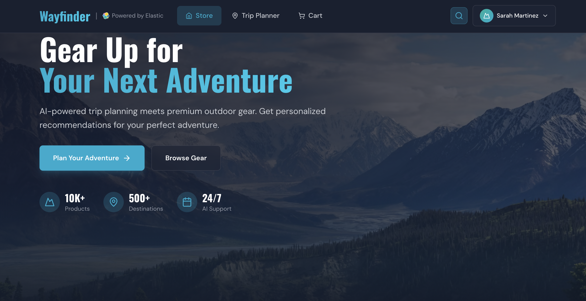

# Wayfinder Supply Co. Workshop

A hands-on workshop demonstrating **Elastic Agentic Search** capabilities through "Wayfinder Supply Co." — a fictional outdoor retailer with an AI-powered trip planning assistant.


## Overview

This workshop showcases how to build an intelligent, conversational shopping experience that goes beyond keyword matching:

- **Federated Data**: Combines Elasticsearch product catalog with simulated CRM (Salesforce) and Weather APIs
- **Personalized Recommendations**: Uses clickstream data to understand user preferences (ultralight, budget, expedition, etc.)
- **AI Trip Planning**: Agent Builder orchestrates multi-step trip planning with gear recommendations
- **Location Intelligence**: Covers 30 global adventure destinations with seasonal activity and weather data
- **Real-time Synthesis**: Creates personalized itineraries with gear checklists based on conditions

## Quick Start

### Prerequisites

- Python 3.11+
- Node.js 18+
- Docker & Docker Compose (for local dev)
- Google Cloud account (for product image generation)

### Local Development

1. **Clone and setup environment**:
   ```bash
   git clone https://github.com/jeffvestal/wayfinder_supply_co.git
   cd wayfinder_supply_co
   cp .env.example .env
   # Edit .env with your credentials
   ```

2. **Generate product data** (requires Google Cloud credentials):
   ```bash
   pip install -r requirements.txt
   python scripts/generate_products.py --mode full
   ```

3. **Start all services**:
   ```bash
   docker-compose up --build
   ```

4. **Access the application**:
   - Unified Frontend & Backend API: http://localhost:8000
   - MCP Server: http://localhost:8001

### Instruqt Environment

The workshop runs on Instruqt with two VMs:

| VM | Services | Purpose |
|----|----------|---------|
| `kubernetes-vm` | Elasticsearch, Kibana, Agent Builder | Elastic Stack |
| `host-1` | Unified UI/Backend (Port 8000), MCP Server (Port 8002) | Application layer |

Setup scripts in `instruqt/track_scripts/` handle all configuration.

### Standalone Demo Setup

Run the complete demo outside of Instruqt using Docker containers connected to your own Elasticsearch cluster.

**Quick setup:**
```bash
# Configure Agent Builder (one-time setup)
./scripts/standalone_setup.sh

# Start all services
docker-compose up -d

# Verify setup
python scripts/validate_setup.py --mode standalone
```

**Access the application:**
- Unified Frontend & Backend API: http://localhost:8000
- MCP Server: http://localhost:8001

For detailed setup instructions, see [Standalone Demo Setup](#standalone-demo-setup) below.

## Architecture

```
┌───────────────────────────────────────────────────────────────┐
│                      Frontend (React)                         │
│                  Modern UI with Trip Planner                  │
└──────────────────────────────┬────────────────────────────────┘
                               │
┌──────────────────────────────▼────────────────────────────────┐
│                   Backend Proxy (FastAPI)                     │
│             Handles auth, streaming, user context             │
└──────────────────────────────┬────────────────────────────────┘
                               │
┌──────────────────────────────▼────────────────────────────────┐
│                        Elastic Stack                          │
│                                                               │
│  ┌─────────────────┐ ┌───────────────┐ ┌───────────────────┐  │
│  │  Elasticsearch  │ │ Agent Builder │ │     Workflows     │  │
│  │  - Products     │ │ Trip Planner  │ │ check_trip_safety │  │
│  │  - Clickstream  │ │               │ │ get_customer_prof │  │
│  └─────────────────┘ └───────────────┘ └─────────┬─────────┘  │
│                                                  │            │
└──────────────────────────────────────────────────┼────────────┘
                                                   │
┌──────────────────────────────────────────────────▼────────────┐
│                     MCP Server (FastMCP)                      │
│            Simulates external APIs (Weather, CRM)             │
│          30 locations with seasonal weather patterns          │
└───────────────────────────────────────────────────────────────┘
```

## Covered Adventure Destinations (30 locations)

| Region | Locations |
|--------|-----------|
| **North America** | Yosemite, Rocky Mountain NP, Yellowstone, Boundary Waters, Moab, PCT, Banff, Whistler, Algonquin |
| **South/Central America** | Patagonia, Costa Rica, Chapada Diamantina (Brazil) |
| **Europe** | Swiss Alps, Scottish Highlands, Norwegian Fjords, Iceland |
| **Africa** | Mount Kilimanjaro, Kruger NP, Atlas Mountains |
| **Asia** | Nepal Himalayas, Japanese Alps, Bali, MacRitchie (Singapore) |
| **Oceania** | NZ South Island, Australian Outback, Great Barrier Reef |
| **Middle East** | Wadi Rum (Jordan), Hatta (Dubai/UAE) |

## Product Catalog

Full catalog covers 10 categories with ~150 products:

- **Camping**: Tents, sleeping bags, pads, kitchen, furniture, lighting
- **Hiking**: Packs, boots, trail runners, poles, hydration, navigation
- **Climbing**: Harnesses, ropes, protection, shoes, helmets, ice gear
- **Winter Sports**: Skis, snowboards, snowshoes, avalanche safety
- **Water Sports**: Kayaks, canoes, paddleboards, wetsuits, snorkel/dive
- **Cycling**: Mountain bikes, helmets, apparel, accessories
- **Fishing**: Rods, tackle, waders, ice fishing gear
- **Apparel**: Base/mid/outer layers, rain gear, sun protection
- **Tropical & Safari**: Insect protection, cooling gear, safari essentials
- **Accessories**: First aid, tools, gloves, gaiters, bags

## Features

### Core Shopping Experience

- **Storefront** — Browse products by category with semantic search
- **Product Cards** — Display title, price, brand, star ratings, review counts, and tags
- **Product Detail Modal** — Full product info with expandable customer reviews
- **Shopping Cart** — Add/remove items, adjust quantities, view totals
- **Checkout Flow** — Address form + credit card (auto-populated for demo)
- **Order Confirmation** — Post-purchase review submission with star ratings

### AI Trip Planning

- **Trip Planner** — Conversational AI assistant for trip planning
- **Context Extraction** — Automatic parsing of destination, dates, and activities
- **Suggested Gear** — Real-time product recommendations from the catalog
- **Day-by-Day Itinerary** — Structured trip plans with export/download options
- **PDF Trip Reports** — Download professional PDF itineraries with suggested gear lists
- **Thought Trace** — Expandable panel showing agent reasoning and tool calls
- **Quick Chat** — Floating chat button for quick questions anywhere in the app

### Product Reviews

- **AI-Generated Reviews** — Realistic reviews generated per product using Gemini
- **Star Ratings** — Aggregate ratings displayed on product cards
- **Review Display** — Expandable review section in product detail modal
- **Post-Purchase Reviews** — Submit reviews after checkout

### User Personalization

- **User Personas** — Pre-built personas with unique shopping scenarios
- **User Menu** — Consolidated dropdown showing current user, scenario, and stats
- **Account Page** — Switch between user personas with full profile display
- **Clickstream Tracking** — Real-time behavior tracking for guest users
- **Personalized Recommendations** — AI uses browsing history to tailor suggestions

## Standalone Demo Setup

Run the complete demo outside of Instruqt using Docker containers connected to your own Elasticsearch cluster.

### Prerequisites

1. **Elasticsearch Cluster**
   - **Standard clusters**: Cluster with snapshot restored (contains `product-catalog` and `user-clickstream` indices)
   - **Serverless clusters**: Empty cluster (use `--load-data` flag to load data directly)
   - API key with permissions for:
     - Reading from indices
     - Creating/updating indices (if using `--load-data`)
     - Creating/updating workflows
     - Creating/updating agents and tools
   - LLM connector configured in Agent Builder (Azure OpenAI GPT-4.1 or compatible)

2. **GCP Bucket Setup** (for product images)
   
   If you're using generated product images, set up a GCS bucket:
   
   ```bash
   # Create bucket with uniform bucket-level access
   gsutil mb -p YOUR_PROJECT_ID gs://wayfinder_supply_co
   gsutil uniformbucketlevelaccess set on gs://wayfinder_supply_co
   
   # Create service account
   gcloud iam service-accounts create wayfinder-supply-co-bucket \
     --display-name="Wayfinder Supply Co Bucket Access"
   
   # Grant Storage Object Admin role (with bucket restriction)
   gcloud projects add-iam-policy-binding YOUR_PROJECT_ID \
     --member="serviceAccount:wayfinder-supply-co-bucket@YOUR_PROJECT_ID.iam.gserviceaccount.com" \
     --role="roles/storage.objectAdmin" \
     --condition="expression=resource.name.startsWith('projects/_/buckets/wayfinder_supply_co'),title=wayfinder_supply_co bucket only"
   
   # Create and download key
   gcloud iam service-accounts keys create ~/wayfinder_supply_co_bucket_key.json \
     --iam-account=wayfinder-supply-co-bucket@YOUR_PROJECT_ID.iam.gserviceaccount.com
   
   # Make bucket publicly readable
   gsutil iam ch allUsers:objectViewer gs://wayfinder_supply_co
   ```

3. **Environment Configuration**
   
   Create a `.env` file with your credentials:
   
   ```bash
   # Snapshot Cluster (for data loading - optional if already done)
   SNAPSHOT_ELASTICSEARCH_URL=https://source-cluster.es.cloud:443
   SNAPSHOT_ELASTICSEARCH_APIKEY=your-snapshot-api-key
   
   # Standalone Demo Cluster
   STANDALONE_ELASTICSEARCH_URL=https://demo-cluster.es.cloud:443
   STANDALONE_ELASTICSEARCH_APIKEY=your-demo-api-key
   STANDALONE_KIBANA_URL=https://demo-cluster.kb.cloud:443
   
   # GCS Configuration (if using images)
   GCS_BUCKET_NAME=wayfinder_supply_co
   GCS_SERVICE_ACCOUNT_KEY=~/wayfinder_supply_co_bucket_key.json
   ```

#### Running the Demo

1. **Configure Agent Builder** (one-time setup):
   
   **For clusters with snapshot restored** (standard deployment):
   ```bash
   # Make sure STANDALONE_* env vars are set (from .env or exported)
   ./scripts/standalone_setup.sh
   ```
   
   **For serverless clusters** (cannot restore snapshots):
   ```bash
   # Make sure STANDALONE_* env vars are set and products.json exists
   ./scripts/standalone_setup.sh --load-data
   ```
   
   The `--load-data` flag will:
   - Create indices and mappings
   - Load product data from `generated_products/products.json`
   - Load clickstream data
   - Then deploy workflows and create agents/tools
   
   **To update data only** (without reconfiguring workflows/agents):
   ```bash
   ./scripts/standalone_setup.sh --data-only
   ```
   
   **Note:** Ensure `generated_products/products.json` exists before using `--load-data` or `--data-only`.

2. **Start all services**:
   ```bash
   docker-compose up -d
   ```

3. **Verify setup**:
   ```bash
   python scripts/validate_setup.py --mode standalone
   ```

4. **Access the application**:
   - Unified Frontend & Backend API: http://localhost:8000
   - MCP Server: http://localhost:8001

#### Understanding Credential Prefixes

- **SNAPSHOT_*** - Used by data loading scripts (`setup_elastic.py`, `seed_products.py`, `seed_clickstream.py`). Connect to your source cluster where you load data and create snapshots.
- **STANDALONE_*** - Used by runtime services (`deploy_workflows.py`, `create_agents.py`, backend services). Connect to your demo cluster where the snapshot is restored.

These may be the same cluster, but separating them allows you to:
- Load data on a development cluster
- Run demos on a production-ready cluster
- Test snapshot restore workflows

## Project Structure

```
wayfinder_supply_co/
├── frontend/                 # React + Vite + Tailwind
│   ├── src/
│   │   ├── components/       # UI components
│   │   │   ├── Storefront.tsx       # Product grid view
│   │   │   ├── TripPlanner.tsx      # AI trip planning interface
│   │   │   ├── ProductCard.tsx      # Product display card
│   │   │   ├── ProductDetailModal.tsx # Full product details + reviews
│   │   │   ├── CartView.tsx         # Shopping cart with quantities
│   │   │   ├── CheckoutPage.tsx     # Checkout form (address + CC)
│   │   │   ├── OrderConfirmation.tsx # Post-purchase reviews
│   │   │   ├── ChatModal.tsx        # Quick chat modal
│   │   │   ├── UserMenu.tsx         # User dropdown with stats
│   │   │   ├── UserAccountPage.tsx  # User selection page
│   │   │   ├── ClickstreamEventsModal.tsx # View browsing history
│   │   │   ├── ItineraryModal.tsx   # Trip export modal
│   │   │   ├── ThoughtTrace.tsx     # Agent reasoning display
│   │   │   └── ...
│   │   ├── lib/              # API client
│   │   └── types/            # TypeScript types
│   └── public/               # Static assets
│
├── backend/                  # FastAPI proxy server
│   ├── main.py               # Entry point
│   ├── routers/              # API routes
│   │   ├── chat.py           # Agent streaming + context extraction
│   │   ├── products.py       # Product search + listing
│   │   ├── cart.py           # Cart management
│   │   ├── reviews.py        # Product reviews
│   │   ├── orders.py         # Order creation
│   │   ├── users.py          # User personas
│   │   └── clickstream.py    # Clickstream tracking + stats
│   └── services/             # Elasticsearch client
│
├── mcp_server/               # FastMCP external API simulation
│   ├── main.py               # Entry point
│   ├── tools/
│   │   ├── weather_service.py  # Location coverage + conditions
│   │   └── crm_service.py      # Customer profiles
│   └── data/
│       ├── locations.json    # 30 adventure destinations
│       └── crm_mock.json     # Sample customer data
│
├── scripts/                  # Setup and generation scripts
│   ├── generate_products.py  # AI product generation (Gemini + Imagen)
│   ├── generate_reviews.py   # AI review generation (batch per product)
│   ├── generate_clickstream.py # User persona clickstream generation
│   ├── update_product_ratings.py # Calculate ratings from reviews
│   ├── setup_elastic.py      # Index creation
│   ├── seed_products.py      # Data indexing (products + reviews)
│   ├── seed_clickstream.py   # Clickstream indexing
│   ├── create_agents.py      # Agent Builder setup
│   └── validate_setup.py     # Health checks
│
├── generated_products/       # Generated data files
│   ├── products.json         # Product catalog
│   ├── reviews.json          # Product reviews
│   └── user_personas.json    # User persona data
│
├── config/                   # Configuration
│   ├── product_generation.yaml  # Full product catalog config
│   └── workflows/            # Elastic Workflow definitions
│
├── instruqt/                 # Instruqt track configuration
│   ├── track.yml             # Track metadata
│   ├── config.yml            # VM configuration
│   └── track_scripts/        # Setup scripts
│
└── docs/                     # Additional documentation
    └── IMAGE_GENERATION_SETUP.md
```

## Clickstream Data & Personalization

Clickstream data powers the personalization engine, allowing the AI to understand user preferences and tailor recommendations based on browsing behavior.

### How Clickstreams Work

The `user-clickstream` Elasticsearch index stores user behavior events:

```json
{
  "user_id": "ultralight_backpacker_sarah",
  "action": "view_item",
  "product_id": "prod_123",
  "tags": ["ultralight", "hiking", "backpacking"],
  "@timestamp": "2024-01-15T10:30:00Z"
}
```

**Event Types:**
- `view_item` — User viewed a product
- `add_to_cart` — User added a product to their cart
- `click_tag` — User clicked on a product tag

### Pre-Generated User Personas

The demo includes 5 user personas with rich backstories and pre-generated clickstream data:

| Persona | Name | Scenario | Behavior Pattern |
|---------|------|----------|------------------|
| **Ultralight Backpacker** | Sarah Martinez | Planning a 3-week Pacific Crest Trail thru-hike | Ultralight gear, premium quality, sub-10lb base weight |
| **Family Camping Dad** | Mike Thompson | Annual family camping trip with 3 kids | Family-friendly, durable, budget-conscious |
| **Weekend Warrior** | Jennifer Walsh | Training for first sprint triathlon | Entry-level gear, versatile, value-focused |
| **Climbing Enthusiast** | David Chen | Planning a climbing trip to Red Rocks | Technical climbing gear, safety equipment |
| **Winter Sports Pro** | Emma Johansson | Backcountry skiing season prep | Premium winter gear, avalanche safety |

Each persona has 8-15 browsing sessions with realistic shopping journeys (e.g., "Researched sleeping bags, compared weights, added ultralight option to cart").

### How Personalization Works

Wayfinder implements personalization by modifying Elasticsearch queries on the fly based on a user's profile. Instead of a separate "black-box" recommendation engine, it uses explicit **Query-Time Boosting**.

#### 1. Data Collection (The Inputs)
We collect behavioral data to understand intent:
*   **Synthetic Data:** Pre-generated history for demo personas (like Sarah Martinez) ensures the system already "knows" their preferences (e.g., "Ultralight" or "Expedition") for immediate impact during demos.
*   **Real-time Data (Guest User):** When a human visitor clicks on product cards or adds items to their cart, the React frontend immediately sends these events to the backend.
    *   **Elasticsearch Storage:** Unlike some systems that use temporary browser sessions, Wayfinder indexes guest activity **directly into Elasticsearch** in real-time. This ensures that the very next search query can immediately leverage the new data for personalization.
    *   **Data Collected:** We track the `user_id` (usually `user_new`), `action` (view_item, add_to_cart), `product_id`, and associated `meta_tags` (e.g., "waterproof", "lightweight", "sub-10lb").

#### 2. Profile Aggregation
The system aggregates these events from the `user-clickstream` index to build a lightweight **User Profile**. This profile is essentially a set of weighted preferences derived from the frequency and type of their interactions.
*   **Example Profile:** `{ "brand_preference": "TrailBlazer (2.5)", "category_preference": "Tents (1.3)" }`

#### 3. Query-Time Boosting
When a search is performed (e.g., "backpacking gear"), the application constructs a **Compound Query** using Elasticsearch's `function_score`:
1.  **Match:** It finds all items matching the text "backpacking gear".
2.  **Boost:** It effectively asks Elasticsearch: *"Find items matching 'backpacking gear', BUT multiply the score by 2.5 if the brand is TrailBlazer and by 1.3 if the category is Tents."*

**The Result:** The search results are technically accurate for the query, but the specific items that align with that user's unique behavior are "nudged" to the top of the list for a tailored experience.

### Guest User: Interactive Demo Mode

The **Guest User** (`user_new`) enables live, interactive demonstrations of personalization:

#### Features

- **Real-Time Tracking** — Every product view and cart add is recorded immediately to Elasticsearch
- **Live Stats** — User menu shows live counts of views and cart adds
- **Event History** — Click on "Views" or "Cart Adds" to see detailed event list
- **Clear History** — Reset all tracked events with one click

#### How to Use for Demos

1. **Switch to Guest User**
   - Click the user menu in the header
   - Click "Switch User" → Select "Guest User"

2. **Demonstrate Behavior Tracking**
   - Browse some products (click on product cards)
   - Add items to cart
   - Open the user menu to see live stats updating
   - Click on "Views" to show the product view history

3. **Show Personalization Impact**
   - After browsing hiking gear, open the Trip Planner
   - Ask: "Plan a weekend camping trip"
   - The AI will prioritize hiking-related recommendations based on recent views

4. **Reset for Next Demo**
   - Click "Clear Browsing History" in the user menu
   - Stats reset to 0
   - Start fresh with a new scenario

### Personalization Integration

The personalization engine integrates user behavior into search queries using a multi-step process:

#### 1. Extracting User Preferences
The backend analyzes the `user-clickstream` index to aggregate the most common `meta_tags` and `categories` the user has interacted with.

```python
# Extracting top preferences from clickstream
def get_user_preferences(user_id: Optional[str], es) -> dict:
    # Aggregates top tags and categories user interacted with
    # Returns: {"tags": ["ultralight", "hiking"], "categories": ["Tents"]}
```

#### 2. Lexical Search Boosting
Standard keyword searches are wrapped in an Elasticsearch `function_score` query. This "nudges" results that match the user's profile to the top.

```json
{
  "function_score": {
    "query": { "match": { "title": "backpacking gear" } },
    "functions": [
      {
        "filter": { "terms": { "tags": ["ultralight", "expedition"] } },
        "weight": 1.5
      },
      {
        "filter": { "terms": { "category": ["Tents"] } },
        "weight": 1.3
      }
    ],
    "boost_mode": "multiply"
  }
}
```

#### 3. Hybrid Search Integration
In hybrid mode, personalization is applied to the **lexical retriever** within a linear combination. This ensures that even conceptual semantic results are influenced by the user's historical preferences.

*   **Semantic weight (0.7):** ELSER results for conceptual matching.
*   **Lexical weight (0.3):** Personalized keyword results with high boost weights (e.g., 10.0x for tags).

## Workshop Flow

1. **Explore the Store** — Browse products, see semantic search in action
2. **Plan a Trip** — Use the AI Trip Planner to get personalized recommendations
3. **Watch the Agent Think** — See the Thought Trace panel show tool calls
4. **Test Personalization** — Switch users to see different recommendations
5. **Try Different Locations** — Test covered vs. uncovered destinations
6. **Interactive Demo** — Use Guest User to show live clickstream tracking
7. **Complete Purchase** — Demo checkout flow with reviews

## Environment Variables

Key environment variables needed for different scenarios:

**For Standalone Demo:**
- `STANDALONE_ELASTICSEARCH_URL` - Demo Elasticsearch endpoint
- `STANDALONE_ELASTICSEARCH_APIKEY` - API key for demo cluster
- `STANDALONE_KIBANA_URL` - Demo Kibana endpoint

**For Data Loading:**
- `SNAPSHOT_ELASTICSEARCH_URL` - Source Elasticsearch endpoint (falls back to `ELASTICSEARCH_URL`)
- `SNAPSHOT_ELASTICSEARCH_APIKEY` - API key for source cluster (falls back to `ELASTICSEARCH_APIKEY`)

**For Product Generation:**
- `GOOGLE_API_KEY` - Gemini API key
- `GOOGLE_CLOUD_PROJECT` - GCP project ID
- `GOOGLE_APPLICATION_CREDENTIALS` - Path to Vertex AI service account JSON
- `GCS_BUCKET_NAME` - GCS bucket for product images
- `GCS_SERVICE_ACCOUNT_KEY` - Path to GCS service account JSON

See `.env.example` for a complete template.

## Simulated External Services

The demo includes two simulated external APIs that run on the MCP Server, demonstrating how Agent Builder integrates with external systems.

### CRM Service (Customer Profiles)

Simulates a Salesforce-like CRM for customer data.

**What it provides:**
- Customer loyalty tier (none, platinum, business)
- Purchase history (items already owned)
- Account type and lifetime value
- Preferences (ultralight, bulk discount, etc.)

**How it's called:**
```
Agent → Workflow Tool → get_customer_profile workflow → HTTP POST to MCP Server → CRM data returned
```

**Mock customers:**
| User ID | Name | Tier | Use Case |
|---------|------|------|----------|
| `user_new` | Jordan Explorer | none | New customer, no history |
| `user_member` | Alex Hiker | platinum | Loyal customer with purchase history |
| `user_business` | Casey Campground | business | B2B account, bulk orders |

**Files:**
- `mcp_server/tools/crm_service.py` — Service implementation
- `mcp_server/data/crm_mock.json` — Mock customer data
- `config/workflows/get_customer_profile.yaml` — Workflow that calls the service

### Weather & Location Service (Trip Conditions)

Simulates a weather/travel conditions API covering 30 global destinations.

**What it provides:**
- Weather conditions (temperature, precipitation, conditions)
- Road alerts (traction laws, closures)
- Seasonal activity recommendations
- Location coverage status (covered vs. uncovered destinations)

**How it's called:**
```
Agent → Workflow Tool → check_trip_safety workflow → HTTP POST to MCP Server → Weather data returned
```

**Coverage:** 30 locations across 7 regions with seasonal weather patterns, activities, and recommendations.

**Files:**
- `mcp_server/tools/weather_service.py` — Service implementation with fuzzy location matching
- `mcp_server/data/locations.json` — 30 destination definitions with seasonal data
- `config/workflows/check_trip_safety.yaml` — Workflow that calls the service

### MCP Server

Both services run on the MCP Server (FastAPI):
- **Port:** 8001 (local) or 8002 (Instruqt)
- **Protocol:** JSON-RPC 2.0
- **Endpoint:** `POST /mcp`

**Start locally:**
```bash
cd mcp_server
uvicorn main:app --host 0.0.0.0 --port 8001
```

**How it works:**
1. Workflows call the MCP Server via HTTP POST with JSON-RPC 2.0 format
2. MCP Server routes to the appropriate tool (`get_customer_profile_tool` or `get_trip_conditions_tool`)
3. Tool reads from mock data files and returns structured JSON
4. Workflow receives response and can log/process the data
5. Agent uses the workflow results for personalization and recommendations

## Dataset & Product Generation

### Current Dataset

The workshop includes a pre-generated product catalog with:

- **~150 products** across 10 categories
- **10 categories**: Camping, Hiking, Climbing, Winter Sports, Water Sports, Cycling, Fishing, Apparel, Tropical & Safari, Accessories
- **80+ subcategories** covering diverse outdoor activities
- **AI-generated product metadata** (titles, descriptions, attributes, prices)
- **AI-generated product images** (via Vertex AI Imagen 3)
- **Product reviews** (5-30 reviews per product with star ratings)

**Output files:**
- `generated_products/products.json` — Product catalog with metadata
- `generated_products/reviews.json` — Product reviews
- `frontend/public/images/products/` — Product images (or GCS URLs)

### Generating More Products

#### Quick Start

Generate products using the default configuration:

```bash
# Generate full catalog (~150 products) with images
python scripts/generate_products.py --config config/product_generation.yaml

# Generate products only (skip images - faster, no Vertex AI costs)
python scripts/generate_products.py --config config/product_generation.yaml --skip-images
```

#### Customizing Product Generation

Edit `config/product_generation.yaml` to customize:

**1. Adjust product counts per subcategory:**
```yaml
categories:
  - name: "Camping"
    subcategories:
      - name: "Tents - 3 Season"
        count: 5  # Generate 5 tents instead of 3
```

**2. Add new categories:**
```yaml
categories:
  - name: "New Category"
    subcategories:
      - name: "New Subcategory"
        count: 3
        description: "Description for AI generation"
        activities: ["activity1", "activity2"]
```

**3. Adjust price ranges:**
```yaml
price_ranges:
  "New Category":
    min: 29.99
    max: 299.99
```

**4. Modify brand weights:**
```yaml
brands:
  - name: "Custom Brand"
    weight: 0.15
    style: "Brand style description"
```

**5. Use different generation modes:**
```yaml
generation_modes:
  test:
    products_per_subcategory: 1
    total_target: 10
  demo:
    products_per_subcategory: 2
    total_target: 50
  full:
    products_per_subcategory: 3
    total_target: 150
```

#### Generation Options

**Skip image generation** (faster, no Vertex AI costs):
```bash
python scripts/generate_products.py --skip-images
```

**Use custom config file:**
```bash
python scripts/generate_products.py --config config/product_generation-tiny.yaml
```

**Metadata only** (no images, no AI calls - uses templates):
```bash
python scripts/generate_products.py --metadata-only
```

### After Generating Products

1. **Upload images to GCS** (if generated):
   ```bash
   python scripts/upload_images_to_gcs.py
   ```

2. **Generate reviews**:
   ```bash
   python scripts/generate_reviews.py
   python scripts/update_product_ratings.py
   ```

3. **Load into Elasticsearch**:
   ```bash
   python scripts/setup_elastic.py
   python scripts/seed_products.py
   ```

See the [Product Generation & Data Loading](#product-generation--data-loading) section below for complete workflow details.

<details>
<summary><strong>Product Generation & Data Loading</strong> (Click to expand)</summary>

This section covers the complete workflow for generating a new product catalog, creating product images, and loading data into Elasticsearch.

### Overview

The product generation pipeline consists of four steps:

1. **Generate Products** — AI-generated product metadata (titles, descriptions, attributes)
2. **Generate Images** — AI-generated product images using Vertex AI Imagen 3
3. **Upload Images** — Upload images to GCS bucket for public access
4. **Load to Elasticsearch** — Create indices and seed product/clickstream data

### Prerequisites

Before generating products, ensure you have:

| Requirement | Purpose |
|-------------|---------|
| `GOOGLE_API_KEY` | Gemini API for product metadata generation |
| `GOOGLE_CLOUD_PROJECT` | GCP project ID for Vertex AI |
| `GOOGLE_APPLICATION_CREDENTIALS` | Service account JSON for Vertex AI Imagen |
| `GCS_BUCKET_NAME` | GCS bucket for product images |
| `GCS_SERVICE_ACCOUNT_KEY` | Service account with bucket write access |
| `SNAPSHOT_ELASTICSEARCH_URL` | Elasticsearch endpoint for data loading |
| `SNAPSHOT_ELASTICSEARCH_APIKEY` | API key with index write permissions |

Install required Python packages:

```bash
pip install -r requirements.txt
```

### Step 1: Generate Products

The `generate_products.py` script creates product metadata using Gemini and optionally generates images using Vertex AI Imagen 3.

#### Configuration Files

| Config File | Products | Use Case |
|-------------|----------|----------|
| `config/product_generation.yaml` | ~150 | Full catalog (10 categories, 80+ subcategories) |
| `config/product_generation-tiny.yaml` | ~4 | Testing/development |

#### Generate Full Catalog (with images)

```bash
# Full catalog with AI-generated images (~150 products)
python scripts/generate_products.py --config config/product_generation.yaml
```

#### Generate Products Only (skip images)

```bash
# Skip image generation (faster, no Vertex AI costs)
python scripts/generate_products.py --config config/product_generation.yaml --skip-images
```

#### Test with Tiny Config

```bash
# Quick test with minimal products
python scripts/generate_products.py --config config/product_generation-tiny.yaml
```

**Output:**
- Product data: `generated_products/products.json`
- Images (if generated): `frontend/public/images/products/`

### Step 2: Upload Images to GCS

After generating images, upload them to GCS for public access:

```bash
# Upload images and update product URLs in products.json
python scripts/upload_images_to_gcs.py

# Or specify custom paths
python scripts/upload_images_to_gcs.py \
  --images-dir frontend/public/images/products \
  --products generated_products/products.json \
  --bucket wayfinder_supply_co \
  --prefix products/
```

**What this does:**
1. Uploads all images from the images directory to GCS
2. Updates `products.json` with public GCS URLs (replaces `/images/products/` paths)

**Options:**

| Flag | Description |
|------|-------------|
| `--images-dir` | Directory containing product images (default: `frontend/public/images/products`) |
| `--products` | Path to products.json (default: `generated_products/products.json`) |
| `--bucket` | GCS bucket name (default: from `GCS_BUCKET_NAME` env var) |
| `--prefix` | GCS prefix/folder (default: `products/`) |
| `--skip-upload` | Skip upload, just update URLs in products.json |
| `--force` | Force re-upload all images (even if they already exist in bucket) |

**Note:** By default, images that already exist in the bucket are skipped to save time and bandwidth.

### Step 3: Setup Elasticsearch Indices

Create the required indices with proper mappings:

```bash
# Create indices (skips if they exist)
python scripts/setup_elastic.py

# Force recreate indices (WARNING: deletes existing data!)
python scripts/setup_elastic.py --force
```

**Created Indices:**
- `product-catalog` — Product data with semantic_text field for ELSER
- `user-clickstream` — User behavior data for personalization

### Step 4: Load Product Data

Seed the product catalog into Elasticsearch:

```bash
# Load products from default path
python scripts/seed_products.py

# Or specify custom products file
python scripts/seed_products.py --products generated_products/products.json
```

### Step 5: Generate Reviews

Generate AI-powered product reviews:

```bash
# Generate reviews for all products (uses batch API for speed)
python scripts/generate_reviews.py

# Update product ratings from reviews
python scripts/update_product_ratings.py
```

**Output:**
- Reviews: `generated_products/reviews.json`
- Updated ratings in `generated_products/products.json`

### Step 6: Generate Clickstream Data

Generate realistic user behavior data with coherent session stories:

```bash
# Generate clickstream and user persona data
python scripts/generate_clickstream.py

# Seed clickstream into Elasticsearch
python scripts/seed_clickstream.py
```

**Generated User Personas:**
- `ultralight_backpacker_sarah` — PCT thru-hiker, ultralight focus
- `family_camping_dad_mike` — Family camping, budget-conscious
- `weekend_warrior_jennifer` — Sprint triathlon training
- `climbing_enthusiast_david` — Red Rocks climbing trip
- `winter_sports_pro_emma` — Backcountry skiing prep
- `user_new` — Guest user (starts empty, tracks live)

**Output:**
- Clickstream events indexed to `user-clickstream`
- User personas: `generated_products/user_personas.json`

### Complete Workflow Example

Here's the full workflow to generate a new product catalog from scratch:

```bash
# 1. Set up environment variables (or use .env file)
export GOOGLE_API_KEY="your-gemini-api-key"
export GOOGLE_CLOUD_PROJECT="your-gcp-project"
export GOOGLE_APPLICATION_CREDENTIALS="/path/to/vertex-service-account.json"
export GCS_BUCKET_NAME="wayfinder_supply_co"
export GCS_SERVICE_ACCOUNT_KEY="/path/to/gcs-service-account.json"
export SNAPSHOT_ELASTICSEARCH_URL="https://your-cluster.es.cloud:443"
export SNAPSHOT_ELASTICSEARCH_APIKEY="your-api-key"

# 2. Generate products and images
python scripts/generate_products.py --config config/product_generation.yaml

# 3. Upload images to GCS
python scripts/upload_images_to_gcs.py

# 4. Generate product reviews
python scripts/generate_reviews.py
python scripts/update_product_ratings.py

# 5. Generate clickstream data and user personas
python scripts/generate_clickstream.py

# 6. Create Elasticsearch indices
python scripts/setup_elastic.py --force

# 7. Load products and reviews into Elasticsearch
python scripts/seed_products.py

# 8. Load clickstream data
python scripts/seed_clickstream.py

# 9. Verify the data
curl -X GET "${SNAPSHOT_ELASTICSEARCH_URL}/product-catalog/_count" \
  -H "Authorization: ApiKey ${SNAPSHOT_ELASTICSEARCH_APIKEY}"
```

### Customizing the Product Catalog

To customize the product catalog, edit `config/product_generation.yaml`:

```yaml
# Adjust product counts per subcategory
categories:
  - name: "Camping"
    subcategories:
      - name: "Tents - 3 Season"
        count: 5  # Generate 5 tents instead of 3

# Add new categories
  - name: "New Category"
    subcategories:
      - name: "New Subcategory"
        count: 3
        description: "Description for AI generation"
        activities: ["activity1", "activity2"]

# Adjust price ranges
price_ranges:
  "New Category":
    min: 29.99
    max: 299.99

# Modify brand weights
brands:
  - name: "Custom Brand"
    weight: 0.15
    style: "Brand style description"
```

### Troubleshooting

| Issue | Solution |
|-------|----------|
| "GOOGLE_API_KEY not set" | Set `GOOGLE_API_KEY` environment variable |
| "Vertex AI not available" | Install: `pip install google-cloud-aiplatform` |
| "Service account key not found" | Check `GCS_SERVICE_ACCOUNT_KEY` path |
| "No products found in index" | Run `seed_products.py` before `seed_clickstream.py` |
| Image generation fails | Verify Vertex AI Imagen API is enabled in GCP |

</details>

## Tech Stack

- **Frontend**: React 18, Vite, TypeScript, Tailwind CSS, Framer Motion, Lucide Icons
- **Backend**: Python 3.11+, FastAPI, httpx, SSE (Server-Sent Events)
- **MCP Server**: FastMCP, Pydantic
- **Search & AI**: Elasticsearch 9.x, ELSER (semantic search), Agent Builder, Workflows
- **Data Generation**: Google Gemini 2.5 Flash (products, reviews), Vertex AI Imagen 3 (images)
- **Personalization**: Elasticsearch clickstream analytics, user affinity scoring

## License

See [LICENSE](LICENSE) file.
