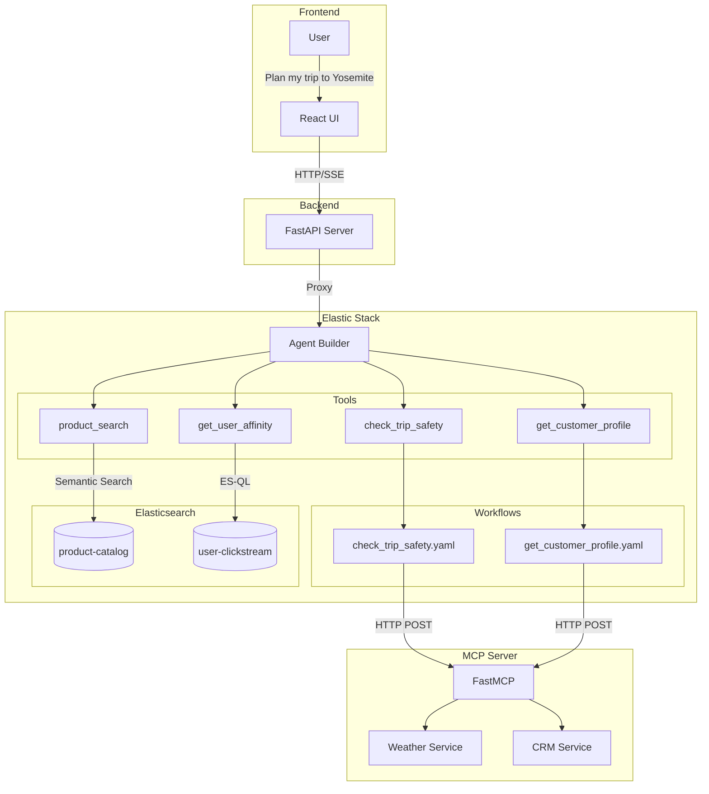

# Field Demo: Builder (15 Minutes)

**Duration:** 15 minutes
**Time Split:** 2 min UI / 13 min Agent Builder + Workflows
**Audience:** Developers, architects who will implement
**Focus:** Full technical deep-dive with hands-on building

---

## Goals

1. Quick context on what we're building (2 min UI)
2. Deep dive into Agent Builder: create/configure an agent
3. Deep dive into Workflows: build a workflow from scratch
4. Show ES|QL tools for clickstream/analytics
5. Connect everything: agent → tools → workflows → external APIs

---

## Pre-Demo Setup

- Wayfinder running locally or on demo instance
- Kibana open with Agent Builder accessible
- Kibana Workflows accessible
- Terminal ready for MCP server if showing that
- Workflow YAML example ready to paste/type

---

## Demo Script

### Scene 1: Quick UI Context (0:00-2:00)

**Talk Track:**
1. "Let me quickly show what we're building."
2. "AI-powered trip planning for an outdoor gear store."
3. "Watch the thought trace - the agent's reasoning is visible."
4. "Weather check... preference lookup... product search..."
5. "Personalized, context-aware recommendations."
6. "Now let's build this from scratch."

**Notes/Action:**
1. Open Trip Planner
2. Select Sarah persona
3. Type: "Planning a 3-day trip to Yosemite in March"
4. Click Send
5. Watch thought trace ~30 sec
6. Show results
7. Switch to Kibana

**Screenshot:** Trip Planner with streaming thought trace

---

### Scene 2: Agent Builder Overview (2:00-4:00)

**Talk Track:**
1. "This is Elastic's Agent Builder."
2. "Think of it as two parts:"
   - "The brain: System prompts, reasoning capabilities"
   - "The capabilities: Tools the agent can use"
3. "Let me show you an existing agent first."
4. "System Prompt: Plain English instructions."
   - "'You are a trip planning assistant for Wayfinder Supply Co.'"
   - "'When users mention a trip, check weather conditions.'"
   - "'Recommend products appropriate for the destination and season.'"
5. "No code - just natural language."
6. "Tools: Four capabilities attached to this agent."

**Notes/Action:**
1. Navigate to Agent Builder
2. Click trip-planner-agent
3. Show system prompt (scroll)
4. Click the Tools tab - show selected tools

**Screenshot:** Agent Builder with prompt and tools visible

---

### Scene 3: Tool Types Deep Dive (4:00-7:00)

**Talk Track:**
1. "Let's examine each tool type."
2. "**product_search** - Type: index_search"
   - "Semantic search against our Elasticsearch product catalog"
   - "Uses ELSER for semantic matching"
3. "**get_user_affinity** - Type: ES|QL"
   - "Custom query against clickstream data"
   - "The ES|QL: `FROM user-clickstream | WHERE user_id == ?user_id | STATS count = COUNT(*) BY meta_tags | SORT count DESC | LIMIT 5`"
   - "Aggregates user's clickstream to find their top preference tags"
4. "**Workflow tools** - check_trip_safety, get_customer_profile"
   - "Call external systems via Workflows"
   - "We'll look at these next"

**Notes/Action:**
1. Click each tool to show config
2. For product_search - show index_search type
3. For get_user_affinity - show the ES|QL query
4. For workflow tools - point at type field

**Screenshot:** Tool configuration panels, ES|QL query visible

---

### Scene 4: Building a Workflow (7:00-11:00)

**Talk Track:**
1. "Now Workflows - the hands."
2. "Here's check_trip_safety in YAML."
3. "**Version and metadata**: name, enabled"
4. "**Inputs**: what the workflow accepts"
   - "location - string, required"
   - "dates - string, required"
5. "**Steps**: what it does"
   - "HTTP POST to MCP server"
   - "JSON-RPC body: `method: tools/call, name: get_trip_conditions_tool`"
   - "Liquid templating: `{{ inputs.location }}`"
6. "**Error handling**: on-failure with retry logic"
7. "Let me test this workflow."
8. "Location: 'Yosemite', Dates: 'March 15'"
9. "Execution succeeded: weather partly cloudy, 28-52°F"
10. "Real data from the weather service."

**Notes/Action:**
1. Navigate to Management → Workflows
2. Click check_trip_safety
3. Walk through YAML sections
4. Point at inputs block
5. Point at steps block
6. Point at HTTP body with MCP call
7. Point at on-failure block
8. Click Run
9. Enter inputs
10. Execute and show results

**Screenshot:** Workflow YAML editor, then execution results

---

### Scene 5: Customer Profile Workflow (11:00-12:00)

**Talk Track:**
1. "Same pattern for get_customer_profile."
2. "HTTP to MCP, calls get_customer_profile_tool with user_id."
3. "Returns: name, loyalty tier, purchase history."
4. "The agent uses this to check what gear you already own."
5. "No need to recommend trekking poles if you bought them last year."

**Notes/Action:**
1. Show get_customer_profile workflow YAML briefly

**Screenshot:** CRM workflow YAML

---

### Scene 6: The Full Architecture (12:00-13:30)

**Talk Track:**
1. "How it connects:"
2. "User asks 'Plan my trip to Yosemite in March'"
3. "Frontend sends message to FastAPI backend"
4. "Backend proxies to Kibana Agent Builder API"
5. "Agent Builder:"
   - "Reads the system prompt"
   - "Analyzes the question"
   - "Decides: 'I need weather data, preferences, and products'"
6. "Tool Calls:"
   - "check_trip_safety → Workflow → MCP → Weather API"
   - "get_user_affinity → ES|QL → Elasticsearch clickstream"
   - "get_customer_profile → Workflow → MCP → CRM API"
   - "product_search → Elasticsearch product catalog"
7. "Response synthesized and streamed back via SSE"

**Notes/Action:**
1. Show or draw architecture diagram
2. Walk through each component

**Architecture Diagram (Mermaid):**



**Screenshot:** Architecture diagram

---

### Scene 7: Key Takeaways (13:30-14:30)

**Talk Track:**
1. "What makes this powerful:"
2. "**Agent Builder - The Brain**"
   - "Natural language system prompts"
   - "Multiple tool types: search, ES|QL, workflow"
   - "The AI decides what to call based on context"
3. "**Workflows - The Hands**"
   - "External API integration"
   - "YAML definitions - version controlled, readable"
   - "Error handling and retry logic"
   - "MCP protocol for standardized tool integration"
4. "**Elasticsearch - The Memory**"
   - "Product catalog with ELSER semantic search"
   - "Clickstream for real-time personalization"
   - "Fast aggregations with ES|QL"
5. "**Full Observability**"
   - "Thought trace shows every step"
   - "Workflow executions are logged"
   - "Debug and audit everything"

**Notes/Action:**
1. Keep architecture diagram on screen OR return to Trip Planner with thought trace expanded
2. Point at Agent Builder section when discussing "The Brain"
3. Point at Workflows section when discussing "The Hands"
4. Point at Elasticsearch section when discussing "The Memory"
5. If on Trip Planner, expand thought trace to show "Full Observability"

**Screenshot:** Architecture diagram with highlights, or Trip Planner with expanded thought trace

---

### Scene 8: Close (14:30-15:00)

**Talk Track:**
1. "Questions?"
2. "Happy to:"
   - "Walk through your specific integration scenario"
   - "Show you the MCP server implementation"
   - "Discuss how this maps to your data and use cases"

**Notes/Action:**
1. .

**Screenshot:** .

---

## Recap

This demo proves the full technical architecture:

1. **Agent Builder** provides AI orchestration with configurable prompts and multi-type tools
2. **Workflows** enable external API integration via MCP with error handling and retries
3. **ES|QL tools** provide real-time aggregations against any Elasticsearch index
4. **Index search tools** leverage ELSER for semantic product discovery
5. **Everything is observable** through thought traces and execution logs

Key message: **Build agentic search applications by combining Agent Builder (brain), Workflows (hands), and Elasticsearch (memory).**

---

## Technical Reference

**Tool Types:**

| Type | When to Use | Example |
|------|-------------|---------|
| `index_search` | Semantic/hybrid search | Product catalog |
| `esql` | Complex aggregations | Clickstream preferences |
| `workflow` | External API calls | Weather, CRM |

**Workflow Step Types:** `http`, `elasticsearch.search`, `elasticsearch.esql.query`, `elasticsearch.index`, `console`, `if`, `kibana.post_agent_builder_converse`

**MCP Protocol:**
```json
{"jsonrpc": "2.0", "method": "tools/call", "params": {"name": "tool_name", "arguments": {"param1": "value1"}}, "id": "request-id"}
```

**Error Handling:**
```yaml
on-failure:
  retry:
    max-attempts: 3
    delay: 2s
```

---

## Common Deep-Dive Questions

**"Can we chain multiple workflows?"** Yes - workflows can call other workflows, or agents can call multiple workflow tools in sequence.

**"How do we secure API keys?"** Workflow variables reference Kibana saved objects or environment variables. Use Elastic's secrets management in production.

**"What's the latency overhead?"** Agent reasoning ~1-2s. Each workflow step adds network latency. Consider caching for real-time use cases.

**"Can we run this on-prem?"** Yes - Agent Builder requires Kibana, Workflows execute in cluster, MCP servers run anywhere.

**"How do we monitor workflow health?"** Workflow executions logged to Elasticsearch. Build dashboards on success/failure rates, latency, errors.
