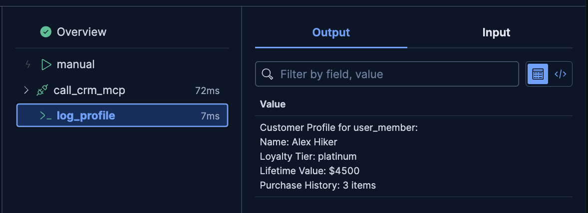

# Build a Workflow

In this challenge, you'll create a workflow that connects to the MCP server to retrieve customer profile data. This workflow will be used by agents to understand customer preferences and purchase history.

---

## What You'll Build

You'll create the `get_customer_profile` workflow that:
1. Accepts a `user_id` as input
2. Calls the MCP server's CRM service
3. Returns customer profile data including loyalty tier and purchase history

---

## Understanding Workflows

**Elastic Workflows** are YAML-based automation that can:
- Call external APIs (like our MCP server)
- Query Elasticsearch using ES|QL
- Chain multiple steps together
- Be used as tools by agents

**Key Concepts:**
- **Inputs**: Parameters the workflow accepts
- **Steps**: Individual actions (HTTP calls, ES|QL queries, console output)
- **Liquid Templating**: Dynamic values using `{{ }}` syntax

---

## Step 1: Open the Workflows UI

1. Open the [button label="Kibana Workflows"](tab-0) tab

2. You should be in the **Workflows** UI. If you switched out of it:
   - Click the **hamburger menu** (☰) in the top-left corner
   - Navigate to **Management** → **Workflows**

---

## Step 2: Create a New Workflow

1. Click **"Create a new workflow"**
2. This will open the YAML editor. Delete all the boilerplate text.

---

## Step 3: Define the Inputs

A workflow needs to know what data it expects.
1. Delete the example code
2. Paste this block into the editor:

```yaml
version: "1"
name: get_customer_profile
enabled: true

inputs:
  - name: user_id
    type: string
    required: true
    description: "The user identifier (e.g., 'user_new', 'user_member', 'user_business')"

triggers:
  - type: manual
```

This tells the workflow to expect one `string` input called `user_id`.

---

## Step 4: Add the HTTP Step

Now let's tell the workflow *what to do*. We'll add a `steps` block that calls the MCP server.

Paste this *below* your `triggers` block:

```yaml
steps:
  - name: call_crm_mcp
    type: http
    with:
      url: "http://host-1:8002/mcp"
      method: POST
      headers:
        Content-Type: application/json
      body:
        jsonrpc: "2.0"
        method: "tools/call"
        params:
          name: "get_customer_profile_tool"
          arguments:
            user_id: "{{ inputs.user_id }}"
        id: "{{ execution.id }}"
    on-failure:
      retry:
        max-attempts: 2
        delay: 1s
```

**Key Points:**
- `{{ inputs.user_id }}` - Liquid template to inject the input value
- `{{ execution.id }}` - Unique execution ID for this workflow run
- `on-failure` - Retry logic for resilience

> [!IMPORTANT]
> Spaces in YAML are important!
> `steps` should be at the beginning of the line (no indent), same level as `triggers`.

---

## Step 5: Add Console Output Step

Add this step *inside* the `steps` block (indented under `steps:`, after the `call_crm_mcp` step):

```yaml
  - name: log_profile
    type: console
    with:
      message: |
        Customer Profile for {{ inputs.user_id }}:
        Name: {{ steps.call_crm_mcp.output.data.result.name }}
        Loyalty Tier: {{ steps.call_crm_mcp.output.data.result.loyalty_tier }}
        Lifetime Value: ${{ steps.call_crm_mcp.output.data.result.lifetime_value }}
        Purchase History: {{ steps.call_crm_mcp.output.data.result.purchase_history | size }} items
```

**Key Points:**
- `steps.call_crm_mcp.output` - Access the previous step's output
- `| size` - Liquid filter to get array size

<details>
  <summary>Click to see Full YAML</summary>

```yaml
version: "1"
name: get_customer_profile
enabled: true

inputs:
  - name: user_id
    type: string
    required: true
    description: "The user identifier (e.g., 'user_new', 'user_member', 'user_business')"

triggers:
  - type: manual

steps:
  - name: call_crm_mcp
    type: http
    with:
      url: "http://host-1:8002/mcp"
      method: POST
      headers:
        Content-Type: application/json
      body:
        jsonrpc: "2.0"
        method: "tools/call"
        params:
          name: "get_customer_profile_tool"
          arguments:
            user_id: "{{ inputs.user_id }}"
        id: "{{ execution.id }}"
    on-failure:
      retry:
        max-attempts: 2
        delay: 1s

  - name: log_profile
    type: console
    with:
      message: |
        Customer Profile for {{ inputs.user_id }}:
        Name: {{ steps.call_crm_mcp.output.data.result.name }}
        Loyalty Tier: {{ steps.call_crm_mcp.output.data.result.loyalty_tier }}
        Lifetime Value: ${{ steps.call_crm_mcp.output.data.result.lifetime_value }}
        Purchase History: {{ steps.call_crm_mcp.output.data.result.purchase_history | size }} items
```

</details>

---

## Step 6: Save and Run the Workflow

1. Click **"Save"** in the top right

2. Click the ▶️ (run) button next to Save

3. A panel will appear asking for the `user_id` input

4. In the `user_id` field, enter `user_member` and click **"Run"**

---

## Step 7: Check the Output

You will see the workflow run in real-time.

1. Click on the `log_profile` step
2. In the **Output** tab, you should see:

```
Customer Profile for user_member:
Name: Sarah Martinez
Loyalty Tier: Platinum
Lifetime Value: $2847.50
Purchase History: 12 items
```



🎉 You've built and run your first workflow!

---

## Understanding Other Workflows

While you built `get_customer_profile`, the system also includes:

**check_trip_safety** - Similar HTTP pattern but calls weather service:
- Calls `get_trip_conditions_tool` on MCP server
- Returns weather conditions and road alerts
- Used by agents to assess trip safety

**get_user_affinity** - ES|QL query pattern:
- Queries `user-clickstream` index
- Analyzes browsing behavior
- Returns top preference tags

You can explore these in Kibana to see different workflow patterns!

---

## Verification

Your workflow should:
- ✅ Be deployed and visible in Kibana
- ✅ Accept `user_id` as input
- ✅ Successfully call the MCP server
- ✅ Return customer profile data

Once verified, you're ready for the next challenge: **Building a Tool** that wraps this workflow!

---

## Troubleshooting

**YAML syntax errors?**
- Check indentation - YAML is space-sensitive
- Use the Full YAML in the collapsible section above as reference
- The editor will highlight syntax errors

**MCP call failing?**
- Open the [button label="Terminal"](tab-1) tab
- Check MCP server is running: `ps aux | grep uvicorn | grep 8002`
- Check MCP server logs: `tail -f /var/log/mcp-server.log`
- Test MCP endpoint: `curl http://localhost:8002/health`

**Workflow not running?**
- Ensure `enabled: true` is set
- Click on the failed step to see error details
- Check the execution logs for more information

