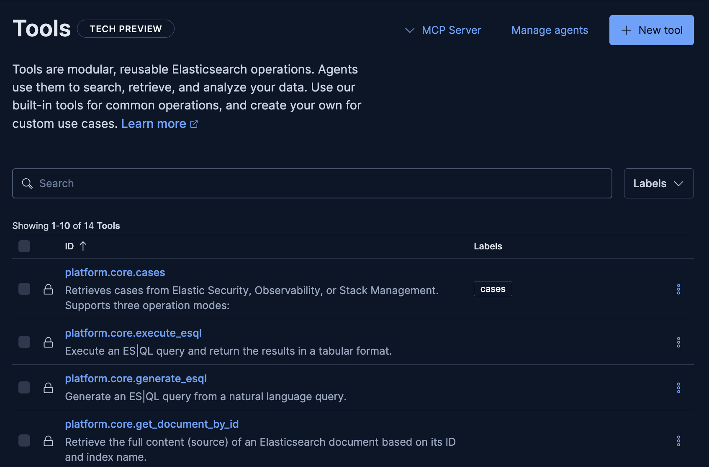
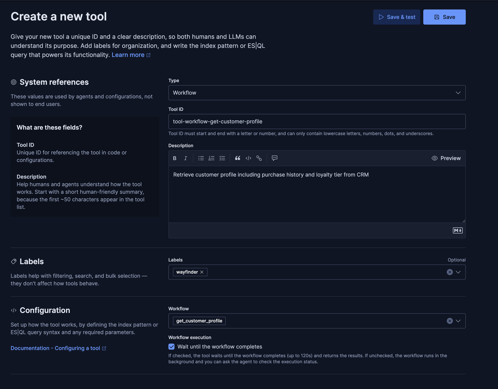
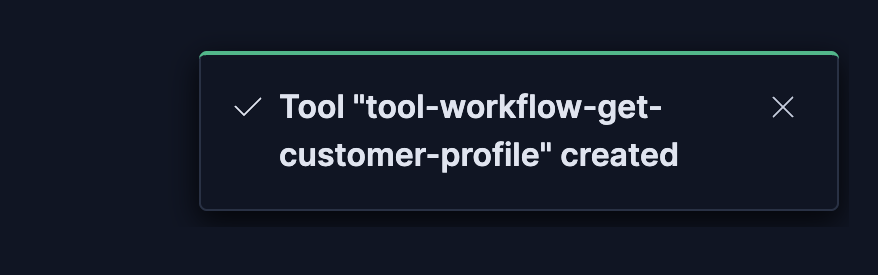
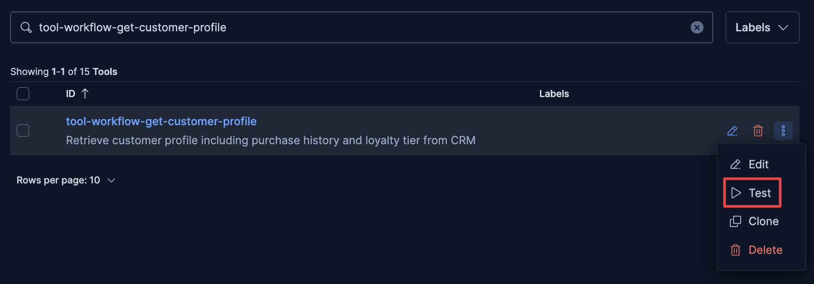
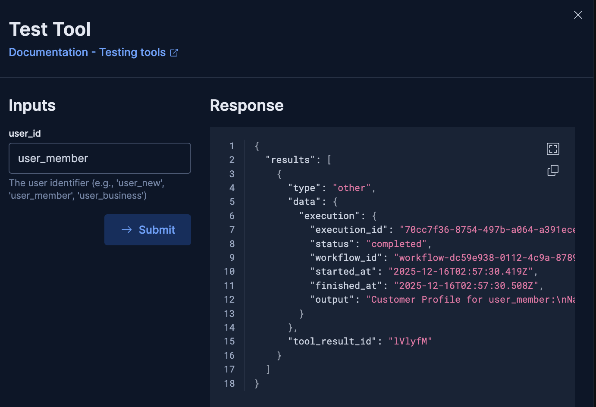

# Build a Tool

Now that you've created a workflow, you need to make it available to agents. In this challenge, you'll create a **tool** that wraps your `get_customer_profile` workflow.

---

## What You'll Build

You'll create a workflow tool that:
- Wraps the `get_customer_profile` workflow you built in Challenge 2
- Makes it available to agents in Agent Builder
- Allows agents to retrieve customer profiles automatically

---

## Understanding Tools

**Tools** are the interface between agents and external capabilities. There are three types:

1. **Workflow Tools** - Wrap Elastic Workflows
2. **ES|QL Tools** - Execute ES|QL queries directly
3. **Index Search Tools** - Search Elasticsearch indices

When an agent needs to retrieve customer data, it calls your workflow tool, which executes the workflow and returns the results.

---

## Step 1: Navigate to Agent Builder Tools

1. Open the [button label="Kibana Agent Builder"](tab-0) tab

2. You should be in the Tools section, if not:
   - Click the **hamburger menu** (☰) in the top-left corner
   - Go to **Elasticsearch** → **Agents** → **More** → **View All Tools**
   - You should see a list of existing tools (like `product_search`, `get_user_affinity`, etc.)



---

## Step 2: Create a New Tool

1. Click the **"+ Add tool"** button

---

## Step 3: Configure the Tool

Fill in the tool configuration form:
### Type
1. Select the tool type:
   - Choose **"Workflow"** from the tool type options
   - This tells Agent Builder that this tool wraps an Elastic Workflow
2. **Workflow **:
   - In the workflow dropdown/selector, find and select `get_customer_profile`
   - This is the workflow you created in Challenge 2
   - The UI will automatically link this tool to your workflow
3. **Workflow execution**
   - Leave this checked.
   - This tells the tool to wait for the workflow to complete and return its output.

### Details
2. **Tool ID**: Enter
	 ```
	tool-workflow-get-customer-profile
	```
   - This is the unique identifier for your tool
   - Use the `tool-workflow-` prefix to indicate it's a workflow tool

3. **Description**: Enter:
   ```
   Retrieve customer profile including purchase history and loyalty tier from CRM
   ```
   - This description is critical! Agents read this to decide when to use your tool
   - Be clear and specific about what the tool does
### Labels
4. **Labels**
   - Enter `wayfinder`

### Configuration


7. Click **"Save"** to create the tool

---

## Step 4: Verify Your Tool

1. After saving, you should be redirected back to the Tools list

2. Find your tool in the list:
   - In the search box enter `tool-workflow-get-customer-profile`

3. Click the 3 dot menu on the right of the row:
4. Click > Test

5. Enter `user_member` in the `user_id` box

6. You should see a response with one result document that includes information about the user.
```nocopy,wrap
"output": "Customer Profile for user_member:\nName: Alex Hiker\nLoyalty Tier: platinum\nLifetime Value: $4500\nPurchase History: 3 items\n"
```
8. Click Cancel to close the test ox

---

## Understanding Other Tools

While you built a workflow tool, the system also includes:

**Index Search Tool** (`product_search`):
```json
{
  "id": "tool-search-product-search",
  "type": "index_search",
  "description": "Search the product catalog for gear recommendations",
  "configuration": {
    "pattern": "product-catalog"
  }
}
```
- Searches the `product-catalog` index
- Used by agents to find products

**ES|QL Tool** (`get_user_affinity`):
```json
{
  "id": "tool-esql-get-user-affinity",
  "type": "esql",
  "description": "Get top gear preference tags from user browsing behavior",
  "configuration": {
    "query": "FROM user-clickstream | WHERE meta_tags IS NOT NULL | STATS count = COUNT(*) BY meta_tags | SORT count DESC | LIMIT 5"
  }
}
```
- Executes ES|QL queries directly
- Used for analytics and aggregations

---

## How Agents Use Tools

When an agent needs customer information, it will:
1. See your tool in its available tools list
2. Read the description: "Retrieve customer profile..."
3. Decide to call it when the user asks about their account or preferences
4. Pass the `user_id` parameter
5. Receive the customer profile data
6. Use that data to personalize recommendations

---

## Verification

Your tool should:
- ✅ Be created and visible in Agent Builder
- ✅ Have the correct workflow_id configured
- ✅ Have a clear description
- ✅ Appear in the tools list

Once verified, you're ready for the next challenge: **Building an Agent** that uses your tool!

---

## Troubleshooting

**Tool not appearing in the list?**
- Refresh the Tools page
- Verify the workflow `get_customer_profile` exists in the Workflows UI
- Check that you selected the correct workflow in the dropdown

**Can't find the workflow in the dropdown?**
- Go back to the Workflows UI and verify `get_customer_profile` is deployed and enabled
- The workflow must be saved and enabled before it appears in the tool creation form

**Tool created but not working?**
- Click on your tool to view its details
- Verify the workflow connection is correct
- Check that the workflow ID matches `get_customer_profile`

**Need help?**
- Review other workflow tools in the Tools list for examples
- Check the tool details of existing tools like `check_trip_safety` to see the pattern

---

## Next Steps

In the next challenge, you'll create an agent that uses this tool (along with others) to orchestrate trip planning. The agent will automatically call your tool when it needs customer information!

