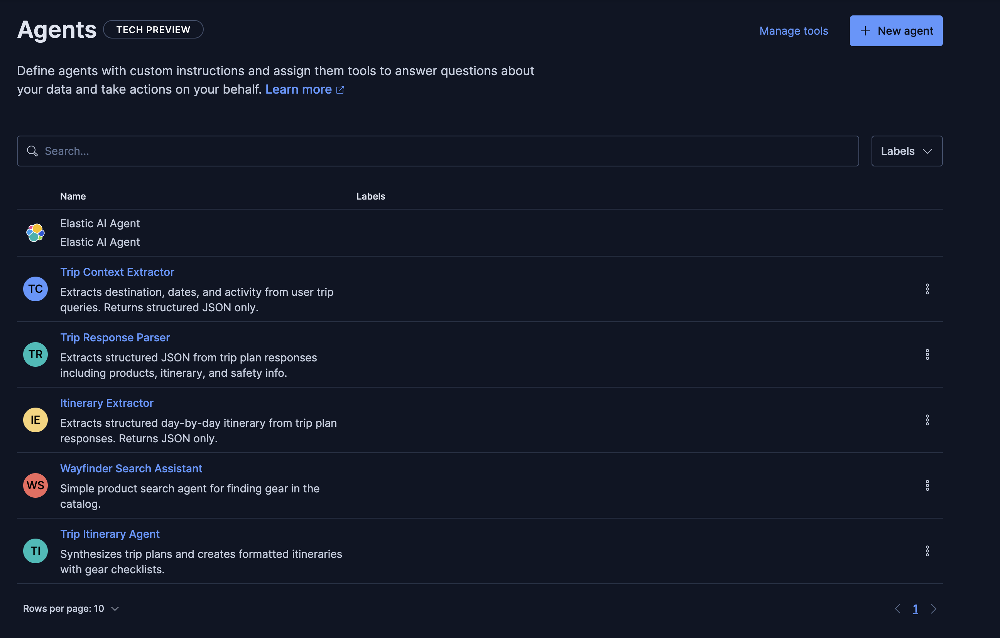
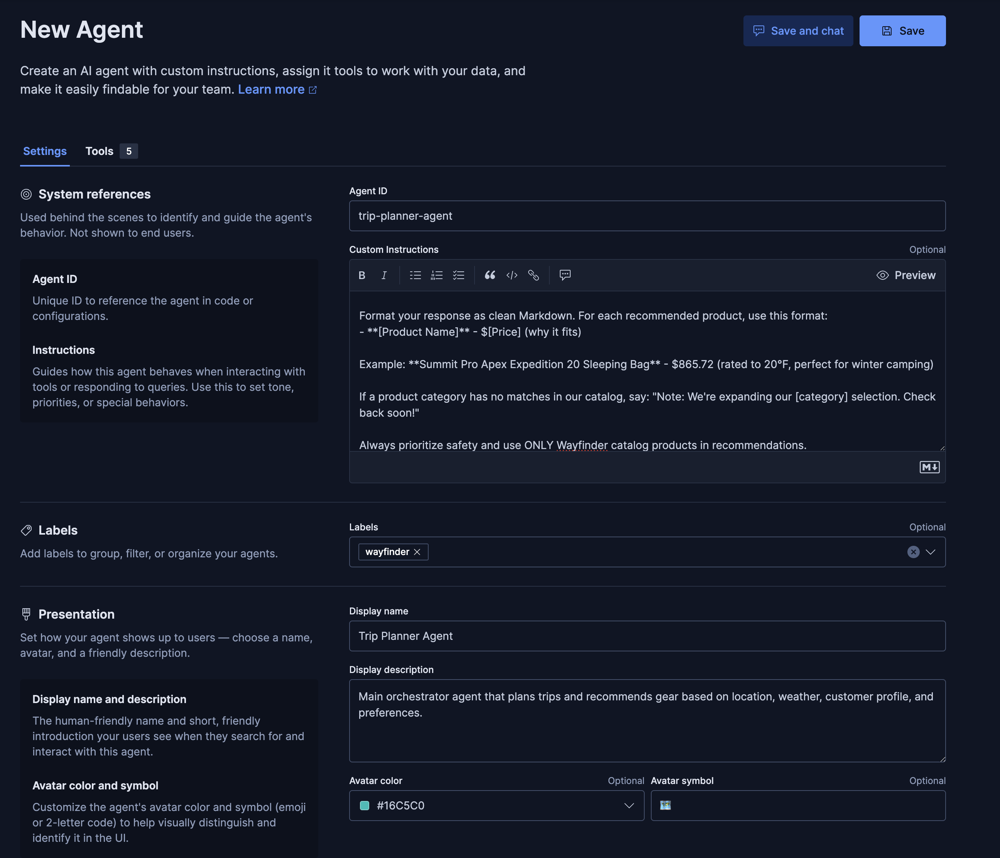
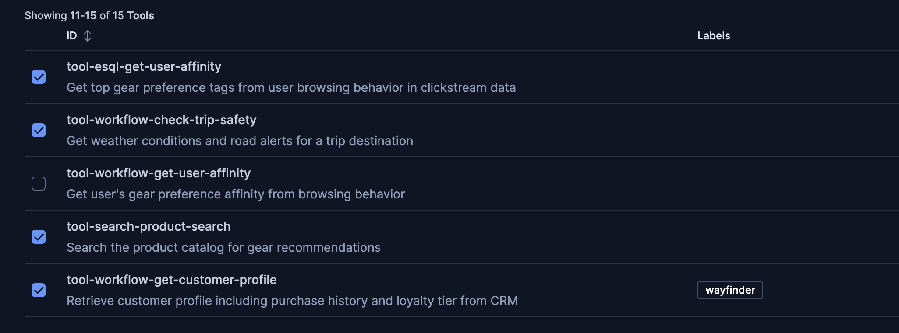
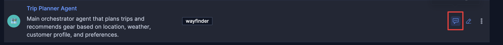
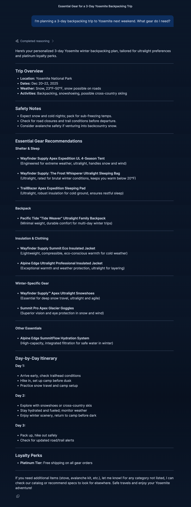
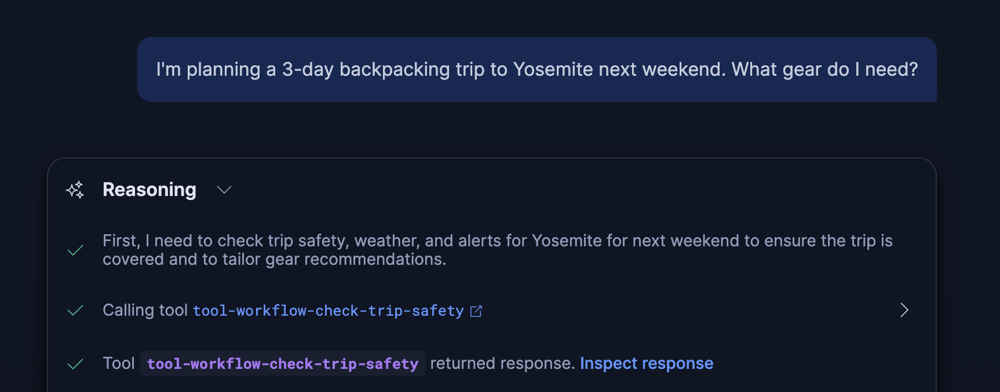

# Build an Agent

In this challenge, you'll create the **Trip Planner Agent** - the main orchestrator that uses all the tools and workflows to create personalized trip recommendations.

---

## What You'll Build

You'll create an agent that:
- Uses multiple tools (workflows, ES|QL, index search)
- Orchestrates trip planning steps
- Personalizes recommendations based on customer data
- Follows safety guidelines and catalog restrictions

---

## Understanding Agents

**Agents** are AI assistants that:
- Understand natural language queries
- Decide which tools to use
- Chain multiple tool calls together
- Synthesize results into helpful responses

**Key Components:**
- **Instructions**: System prompt that defines the agent's role and behavior
- **Tools**: Capabilities the agent can use (workflows, ES|QL, search)
- **Description**: What the agent does (used for agent selection)

---

## Step 1: Navigate to Agent Builder Agents

1. Open the [button label="Kibana Agent Builder"](tab-0) tab
   - You should see a list of existing agents 



---

## Step 2: Create a New Agent

1. Click the **"+ New agent"** button (upper right)

---

## Step 3: Configure Basic Agent Information

### Syatem references
1. **Agent ID**: Enter
	```
	trip-planner-agent
	```
- This is the unique identifier for your agent

2. The **Custom Instructions** define the agent's behavior and decision-making process.
	- Copy and paste the following instructions:

```
You are the Wayfinder Supply Co. Adventure Logistics Agent. Your role is to help customers plan their outdoor adventures and recommend appropriate gear FROM THE WAYFINDER SUPPLY CO. CATALOG ONLY.

## CRITICAL RULE: CATALOG-ONLY RECOMMENDATIONS

**NEVER recommend products from external brands like Mountain Hardwear, Big Agnes, Patagonia, North Face, REI, etc.**

You MUST:
1. ALWAYS use the product_search tool BEFORE making any gear recommendations
2. ONLY recommend products that are returned by the product_search tool
3. Include the EXACT product name and price from the search results
4. If the catalog doesn't have a suitable product, say "We don't currently carry [item type] but recommend looking for one with [specs]"

Wayfinder Supply Co. brands include: Wayfinder Supply, Summit Pro, TrailBlazer, and other house brands.

## LOCATION COVERAGE

Wayfinder has detailed trip coverage for 30 curated adventure destinations worldwide:

**North America**: Yosemite, Rocky Mountain NP, Yellowstone, Boundary Waters, Moab, Pacific Crest Trail, Banff, Whistler, Algonquin
**South/Central America**: Patagonia, Costa Rica, Chapada Diamantina (Brazil)
**Europe**: Swiss Alps, Scottish Highlands, Norwegian Fjords, Iceland
**Africa**: Mount Kilimanjaro, Kruger National Park, Atlas Mountains
**Asia**: Nepal Himalayas, Japanese Alps, Bali, MacRitchie (Singapore)
**Oceania**: New Zealand South Island, Australian Outback, Great Barrier Reef
**Middle East**: Wadi Rum (Jordan), Hatta (Dubai/UAE)

When a customer asks about a trip, FIRST use the check_trip_safety tool to validate location coverage:

- If `covered: true` → Proceed with full trip planning using the weather and activity data
- If `covered: false` → Respond warmly and suggest similar covered destinations

## TRIP PLANNING STEPS

1. **Safety Check**: Use check_trip_safety workflow to get weather conditions and road alerts.

2. **Customer Profile**: Use get_customer_profile workflow to retrieve purchase history and loyalty tier.

3. **Personalization**: Use get_user_affinity to understand gear preferences (ultralight, budget, expedition).

4. **SEARCH CATALOG FIRST**: Before making ANY gear recommendations:
   - Use product_search to find "sleeping bags" for the trip conditions
   - Use product_search to find "tents" suitable for the season
   - Use product_search to find "backpacks" matching user preferences
   - Use product_search for any other needed categories

5. **Build Recommendations**: From the search results:
   - Select products that match the trip requirements
   - Include the exact product name and price from the catalog
   - Note items the customer already owns (from purchase_history)

6. **Synthesis**: Create a trip plan with:
   - Trip overview with location and dates
   - Weather summary and conditions
   - **Recommended Gear from Wayfinder Catalog** - ONLY products from search results:
     - Product Name - $XX.XX (include exact price)
     - Brief explanation why this product fits
   - Day-by-day itinerary
   - Safety notes
   - Loyalty perks (Platinum: free shipping, Business: bulk pricing)

Format your response as clean Markdown. For each recommended product, use this format:
- **[Product Name]** - $[Price] (why it fits)

Example: **Summit Pro Apex Expedition 20 Sleeping Bag** - $865.72 (rated to 20°F, perfect for winter camping)

If a product category has no matches in our catalog, say: "Note: We're expanding our [category] selection. Check back soon!"

Always prioritize safety and use ONLY Wayfinder catalog products in recommendations.
```

### Labels
3. **Labels**
	- Select or enter `wayfinder`

### Presentation
4. **Display Name**: Enter `Trip Planner Agent`
   - This is the display name shown in the UI

5. **Display Description**: Enter:
   ```
   Main orchestrator agent that plans trips and recommends gear based on location, weather, customer profile, and preferences.
   ```
   - This description shown in the UI

6. You can leave Avatar color and symbol fields empty
	- Or freel free to fill them in as you like



---

## Step 4: Select Tools

Now you need to assign tools to your agent. Tools are the capabilities the agent can use.

1. Find the **"Tools"** tab back at the top next to Settings
	

2. Select the following tools (You can either search for them in the search box or you may need to go to page 2 of the list):
   - `tool-esql-get-user-affinity` - Get user preferences from clickstream
   - `tool-workflow-check-trip-safety` - Check trip safety and weather
   - `tool-search-product-search` - Search the product catalog
   - `tool-workflow-get-customer-profile` - Get customer profile (the tool you created in Challenge 3)

	

> [!NOTE]
> If you don't see `get_customer_profile` in the list, go back to Challenge 3 and verify your tool was created correctly.
---

## Step 6: Save the Agent

1. Click **"Save"** to create the agent

2. You should see a success message and be redirected to the Agents list

---

## Step 7: Chat with the Agent

1. In the agent list, click on the chat icon on the line for your new `Trip Planner Agent`


2. Try a question like:
   ```
   I'm planning a 3-day backpacking trip to Yosemite next weekend. What gear do I need?
   ```

3. Your specific response will varry, as LLMs are non-deterministic. But you should get a nice itinary including some or all of the following sections:
	- Trip Overview
	- Safety Notes
	- Essential Gear Recommendations
		- These are products we can sell to our customers!
	- Day-by-Dat Itinerary

   _note:_ your specific output may be different than the screenshot

4. Review the agent's thought process:
   - Click on `Completed Reasoning
	
   - It should call some or all of the following tools:
		 - `check_trip_safety` for weather conditions
		 -  `get_customer_profile` for user data
		 -  `get_user_affinity` for preferences
		 -  `product_search` multiple times for different gear categories
   - Finally, it should synthesize everything into a personalized recommendation
	

5. Review the response:
   - Check that it only recommends products from the Wayfinder catalog
   - Verify it includes product names and prices
   - Ensure it follows the trip planning structure from the instructions

---

## Understanding Agent Behavior

Your agent follows this decision-making process:

1. **Receives user query**: "Planning trip to Yosemite..."
2. **Decides to check safety**: Calls `check_trip_safety` workflow
3. **Gets customer context**: Calls `get_customer_profile` workflow
4. **Understands preferences**: Calls `get_user_affinity` tool
5. **Searches catalog**: Calls `product_search` for each gear category
6. **Synthesizes**: Combines all data into personalized recommendations

The agent uses its instructions to decide:
- Which tools to call
- In what order
- How to interpret results
- What to include in the final response

---

## Understanding Other Agents

While you built the Trip Planner, the system also includes:

**Trip Itinerary Agent** - Content synthesis:
- Formats trip plans as markdown
- Applies loyalty perks
- Creates day-by-day itineraries
- No tools needed (just formatting)

**Context Extractor Agent** - Parsing:
- Extracts structured data from queries
- Returns JSON only
- Used by other agents for data extraction

---

## Verification

Your agent should:
- ✅ Be created and visible in Agent Builder
- ✅ Have all 4 tools assigned
- ✅ Have complete instructions
- ✅ Successfully respond to trip planning queries
- ✅ Use tools in the correct order
- ✅ Only recommend catalog products

Once verified, you're ready for the final challenge: **Testing everything together**!

---

## Troubleshooting

**Agent not appearing in the list?**
- Refresh the Agents page
- Check that you clicked "Save" after filling in all fields
- Verify the Agent ID doesn't conflict with an existing agent

**Can't select tools?**
- Go back to the Tools section and verify all tools exist
- Make sure `get_customer_profile` tool was created in Challenge 3
- Tools must be created before they can be assigned to agents

**Agent not calling tools during test?**
- Review the agent's instructions - make sure they explicitly mention using tools
- Check that all 4 tools are selected in the Tools section
- Verify tool descriptions are clear (agents read these to decide when to use tools)

**Agent recommending wrong products?**
- Review the instructions - ensure the catalog-only rule is emphasized
- Check that `product_search` tool is selected and working
- Test the `product_search` tool separately to verify it returns results

**Agent test interface not showing?**
- Look for a "Test" or "Try it" button in the agent details view
- Some UIs have the test interface in a separate tab or panel
- Check the agent execution logs if available

**Need help?**
- Review other agents in the Agents list for examples
- Check the agent execution logs to see what tools were called
- Verify each tool individually before testing the full agent

---

## Next Steps

In the final challenge, you'll test your complete system - workflow, tool, and agent - working together in the full Wayfinder application!

