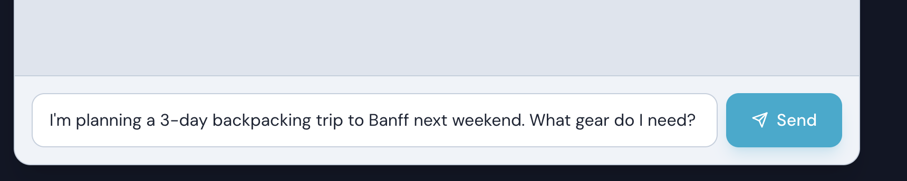
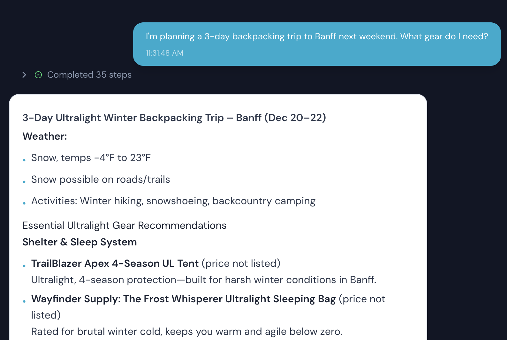
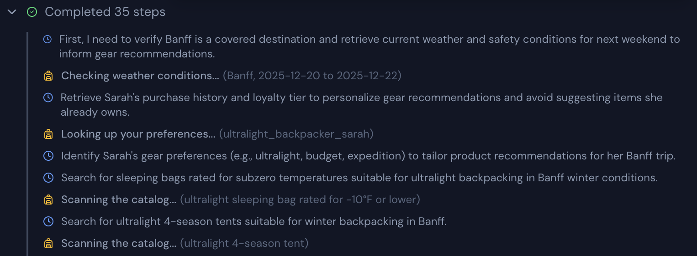
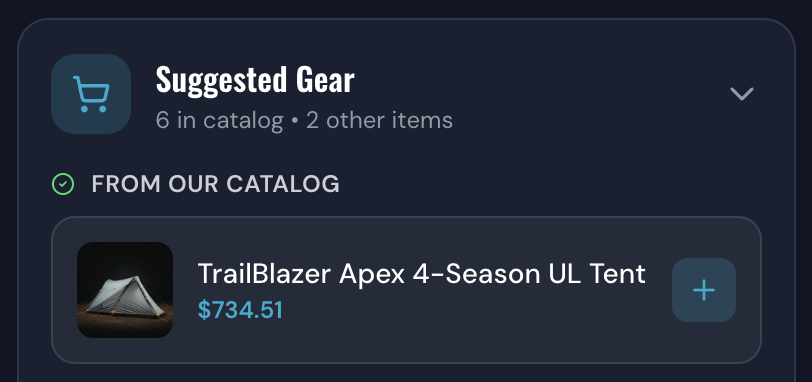
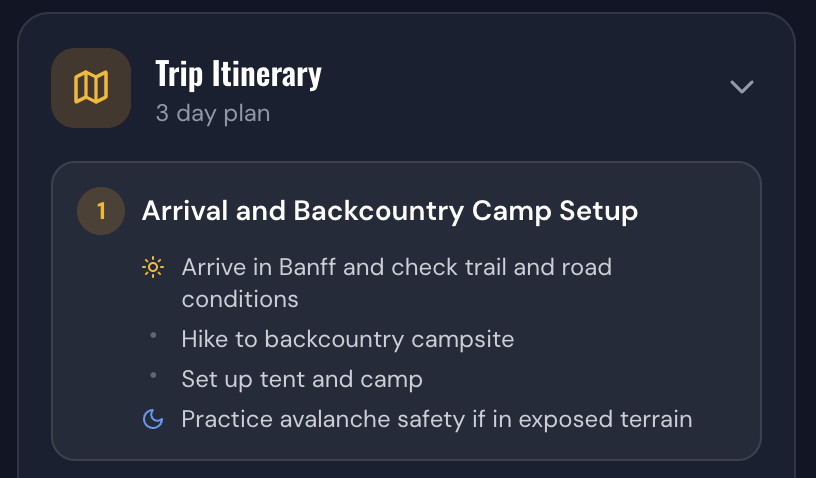

# Bring It All Together

Congratulations! You've built all the components. Now let's test your complete system - workflow, tool, and agent - working together in the full Wayfinder application.

---

## What You've Built

Throughout this workshop, you've created different types of agentic tools:
1. **Workflow** - `get_customer_profile`
	 - Connects to MCP server for CRM data
3. **Tool** - `tool-workflow-get-customer-profile`
	- Makes workflow available to agents
4. **Agent** - `trip-planner-agent`
	- Orchestrates all tools to plan trips

Now let's see them work together!

---

## Step 1: Test in Wayfinder UI

1. Open the [button label="Wayfinder UI"](tab-0) tab
	> [!NOTE]
	> If you need more screen space, you can  open the Wayfinder store in a new tab by clicking
	>
	> the second tab [button label="UI (Popout)"](tab-1)

2. Click on **Trip Planner**
	

3. Try a trip planning query.In the chat box at the bottom enter:
   ```
   I'm planning a 3-day backpacking trip to Banff next weekend. What gear do I need?
   ```
	 Click `Send`
	 

4. **View our Plan** <br>
Just like chatting with our agent in Kibana, this custom Trip Planner will give varying answers (Because its the same agent!).
But, you should see a similar trip plan

_note:_ Your plan will be different since you are running at a different date!

4. **Review the Thought Trace** <br>
Also just as we did in Kibana, we can view the thought trace of the agent. Here click on `Completed xx steps`
You'll see some of the following calls
   - ✅ `check_trip_safety` workflow called (weather data)
   - ✅ `get_customer_profile` workflow called (your workflow!)
   - ✅ `get_user_affinity` tool called (preferences)
   - ✅ `product_search` tool called multiple times (gear recommendations)
   - ✅ Agent synthesizing the response
	

6. **E-Commerce tie-in**<br>
Our Agent and tools built a helpful trip itineary for our customer. However, ultimately as an e-commerce store we are selling products. <br>
Our trip planner extracts
	1. product suggests, which we sell. Users can click on the + in the small card to add the item to the cart
	 
	1. Daily trip itinary details
	


---

## Step 3: Test Personalization

Now that the system is fully integrated, let's explore how the **Agentic** experience differs from standard search and how your new workflow enables deep personalization.

### Option A: The "Wow" Moments (Easy Review)
If you want to see the power of personalization and agentic search quickly, we've built specific comparison tools:

1. **Watch Demo (One-Click):** Click the [button label="Watch Demo"](tab-0) button in the header. This runs a fully automated walkthrough comparing Lexical, Hybrid, and Agentic search for a complex trip planning query.
2. **"Wow" Dropdown:** Click the [button label="Wow"](tab-0) dropdown in the header:
   - **Personalization Difference:** Directly compares search results for a **Guest User** vs. **Alex Hiker** (who has a deep history of ultralight gear).
   - **Search Mode Comparison:** Shows a side-by-side view of Lexical, Hybrid, and Agentic results for the same query.

### Option B: Interactive Testing (Persona Switching)
To manually test how your `get_customer_profile` workflow impacts the AI's recommendations:

1. **Switch Users:** Click the user icon in the top right header → click **Switch User** → Select a persona.
2. **Try a Query:** In the **Trip Planner** or the **Search & Chat** panel, ask:
   ```
   Suggest some gear for a camping trip
   ```
3. **Compare the results:**
   - **Jordan Explorer (New User):** Should receive general, entry-level camping gear.
   - **Alex Hiker (Platinum/Ultralight):** Should see high-end, weight-conscious recommendations (e.g., Summit Pro series).
   - **Casey Campground (Business):** Should see recommendations that include bulk options or durable, fleet-ready gear.

4. **Verify the Workflow:** Expand the `Completed xx steps` trace above the assistant bubble. You should see the ✅ `get_customer_profile` workflow being called to fetch these unique preferences!

---


## What You've Accomplished

You've successfully built a complete agentic search system:

✅ **Workflow** - Automated data retrieval from external systems
✅ **Tool** - Made workflow available to AI agents
✅ **Agent** - Orchestrated multiple tools to create intelligent responses
✅ **Integration** - All components working together seamlessly

---

## Understanding the Full Flow

Here's what happens when a user asks about a trip:

1. **User Query** → Frontend sends to Backend
2. **Backend** → Proxies to Agent Builder
3. **Agent** → Decides to call `check_trip_safety` workflow
4. **Workflow** → Calls MCP server for weather
5. **Agent** → Decides to call `get_customer_profile` workflow (your workflow!)
6. **Workflow** → Calls MCP server for CRM data
7. **Agent** → Calls `get_user_affinity` for preferences
8. **Agent** → Calls `product_search` multiple times for gear
9. **Agent** → Synthesizes all data into personalized recommendations
10. **Response** → Streams back to user via SSE

Your workflow is a critical part of this flow, providing customer context that enables personalization!

---

## Next Steps

Now that you've built the complete system, you can:

- **Extend workflows** - Add more steps, call additional APIs
- **Create more tools** - Wrap other workflows or create ES|QL tools
- **Enhance agents** - Add more sophisticated reasoning, chain multiple agents
- **Explore patterns** - Review other workflows and agents in the system

---


## Congratulations! 🎉

You've completed the Wayfinder Supply Co. workshop and built a complete agentic search system. You now understand how to:

- Create workflows that connect to external systems
- Build tools that make workflows available to agents
- Design agents that orchestrate multiple capabilities
- Integrate everything into a working application

**You're ready to build your own agentic search experiences!**

